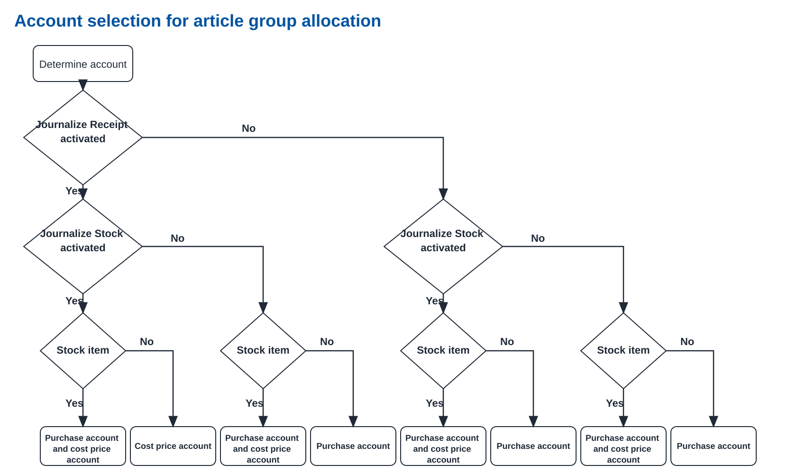

Starting with Profit 8, several changes have been implemented in the AFAS Profit API. Below are the changes compared to Profit 7. Curious about our roadmap? [Click here](https://www.afas.nl/roadmap)  

> How to read this? Profit has an extensive API with many different components. The API specifications are divided into related sections. Changes are indicated per section.  

> In the release notes of Profit 7, a number of changes have already been implemented. These changes also apply to Profit 8. [Click here](./news-profit7) for the release notes of Profit 7.

## **Breaking changes**

### FbPurRequisition enforces stricter allocation-code requirements

*(added 2026-07-14)*  
Previously, when creating a purchase requisition, you could choose any allocation code that existed. Now, the allocation code must exist in an allocation assignment of the purchase account or cost price account of the item group. See the diagram below. In most cases, this will cause no problems, because the same allocation assignment should already exist further in the process.  

### Language Codes Simplified

Up to and including Profit 7, Profit used two tables for language codes. You maintained the language codes used in Profit via `General / Configuration / Country Settings / Language`. For each language code, you could select an ISO language code. The ISO language codes themselves could be maintained via `General / Configuration / Free Table, ISO Language Code Table`.

We have simplified this by making the complete Microsoft language table available under `General / Configuration / Country Settings / Language`. As a result, it is no longer necessary to add languages manually.

We aim to ensure that Imports, Get Connectors, and Update Connectors continue to function. **However, it is strongly recommended that you switch to the new language codes as soon as possible.**

You will also see this change reflected in the Update Connectors changelog further on.

## Important changes

### IP restrictions now follow CIDR notation

You can set IP restrictions on an AppConnector. We strongly recommend applying this as much as possible. Previously, IP restrictions could be defined as an IP address with an optional subnet mask. Starting with Profit 8, you define multiple IP addresses using CIDR notation.

#### mTLS support on connectors

*(added 2026-07-16)*  
> This will not be available until September 2026. The UI is prepared for it, but the infrastructure is not yet available.

Starting with Profit 8, it is possible to use mTLS (mutual TLS) on connectors. mTLS is a security protocol in which both the client and the server must authenticate themselves with a certificate. This provides an extra layer of security, because only authorized clients can connect to the server.
For now, you cannot test this on connect.afas.nl.

### Webhooks!

A long-cherished wish has come true: Webhooks! [Read more about Webhooks in Profit](./webhooks).

## Other changes

### BI models now respect definition-level filter authorization

This may result in an OData connector call returning no results after switching to Profit 8. Definition-level filter authorization ensures that users only receive results they are allowed to access. Check whether the token user has the correct authorizations to see the expected results.

### BI models: authorize New, Import, and Export actions separately

The actions New, Import, and Export can now be authorized separately. As a result, you or a customer may no longer have these actions available.

### Additional languages available

Starting with Profit 8, Profit supports additional languages. This applies to both the user interface and the connectors.
For now, you cannot test this on connect.afas.nl.

### GetConnector now shows date/time of the last call

This field has always been available on the definition of a GetConnector, but from Profit 8 onward it is now actually populated. The field has been added to several views, so for example, from the AppConnector you can directly see which GetConnectors are being actively called.

### IP restrictions now also possible on IPv6

Because AFAS Online now supports IPv6, it is also possible to create IP restrictions on IPv6 addresses in an AppConnector. Previously, a restriction on an IPv6 address would block all traffic.

### Microsoft Entra ID integration is now standard functionality

Starting with Profit 8, you can set up an integration with Microsoft Entra directly from Profit. You configure the integration by indicating on a user group which Entra group is linked to it. Users are automatically synchronized to Entra based on their group membership.
Are you currently offering an integration with Microsoft Entra ID? Then make sure to review this carefully and determine where your added value lies compared to the new standard functionality.

## Artikelen Specification

### All changes

| Connector | Description | Operation |
| --- | --- | --- |
| FbComposition | added the new optional request property `FbComposition/Element/Fields/ABCXYZClass` | [POST](https://docs.afas.help/apidoc/nl/Artikelen#post-/connectors/FbComposition), [PUT](https://docs.afas.help/apidoc/nl/Artikelen#put-/connectors/FbComposition) |
| FbComposition | added the new optional request property `FbComposition/Element/Fields/CCls` | [POST](https://docs.afas.help/apidoc/nl/Artikelen#post-/connectors/FbComposition), [PUT](https://docs.afas.help/apidoc/nl/Artikelen#put-/connectors/FbComposition) |
| FbComposition | added the new optional request property `FbComposition/Element/Fields/PreC` | [POST](https://docs.afas.help/apidoc/nl/Artikelen#post-/connectors/FbComposition), [PUT](https://docs.afas.help/apidoc/nl/Artikelen#put-/connectors/FbComposition) |
| FbItemArticle | added the new optional request property `FbItemArticle/Element/Fields/ABCXYZClass` | [POST](https://docs.afas.help/apidoc/nl/Artikelen#post-/connectors/FbItemArticle), [PUT](https://docs.afas.help/apidoc/nl/Artikelen#put-/connectors/FbItemArticle) |
| FbItemArticle | added the new optional request property `FbItemArticle/Element/Fields/PreC` | [POST](https://docs.afas.help/apidoc/nl/Artikelen#post-/connectors/FbItemArticle), [PUT](https://docs.afas.help/apidoc/nl/Artikelen#put-/connectors/FbItemArticle) |

## Bakkerijen Specification

No changes for this release.

## Bouw Specification

No changes for this release.

## Budgetten en activa Specification

No changes for this release.

## Cursusmanagement Specification

No changes for this release.

## Dossiers en bijlagen en workflows Specification

### All changes

| Connector | Description | Operation |
| --- | --- | --- |
| KnSubject | added the new optional request property `KnSubject/Element/Fields/SubjectHandler` | [POST](https://docs.afas.help/apidoc/nl/Dossiers%20en%20bijlagen%20en%20workflows#post-/connectors/KnSubject), [PUT](https://docs.afas.help/apidoc/nl/Dossiers%20en%20bijlagen%20en%20workflows#put-/connectors/KnSubject) |
| KnSubjectDynamic | added the new optional request property `KnSubjectDynamic/Element/Fields/ProfileId` | [POST](https://docs.afas.help/apidoc/nl/Dossiers%20en%20bijlagen%20en%20workflows#post-/connectors/KnSubjectDynamic), [PUT](https://docs.afas.help/apidoc/nl/Dossiers%20en%20bijlagen%20en%20workflows#put-/connectors/KnSubjectDynamic) |

## Financiële Inrichting Specification

No changes for this release.

## Fiscaal Specification

### All changes

| Connector | Description | Operation |
| --- | --- | --- |
| TxClientIB2021 | the `TxClientIB2021/Element/Objects/KnPerson/Element/Fields/LgId` request property's maxLength was increased from `3` to `5` | [POST](https://docs.afas.help/apidoc/nl/Fiscaal#post-/connectors/TxClientIB2021) |
| TxClientIB2021 | the `TxClientIB2021/Element/Objects/KnPerson/Element/Objects/KnContact/Element/Objects/KnPerson/Element/Fields/LgId` request property's maxLength was increased from `3` to `5` | [POST](https://docs.afas.help/apidoc/nl/Fiscaal#post-/connectors/TxClientIB2021) |
| TxClientIB2022 | the `TxClientIB2022/Element/Objects/KnPerson/Element/Fields/LgId` request property's maxLength was increased from `3` to `5` | [POST](https://docs.afas.help/apidoc/nl/Fiscaal#post-/connectors/TxClientIB2022) |
| TxClientIB2022 | the `TxClientIB2022/Element/Objects/KnPerson/Element/Objects/KnContact/Element/Objects/KnPerson/Element/Fields/LgId` request property's maxLength was increased from `3` to `5` | [POST](https://docs.afas.help/apidoc/nl/Fiscaal#post-/connectors/TxClientIB2022) |
| TxClientIB2023 | the `TxClientIB2023/Element/Objects/KnPerson/Element/Fields/LgId` request property's maxLength was increased from `3` to `5` | [POST](https://docs.afas.help/apidoc/nl/Fiscaal#post-/connectors/TxClientIB2023) |
| TxClientIB2023 | the `TxClientIB2023/Element/Objects/KnPerson/Element/Objects/KnContact/Element/Objects/KnPerson/Element/Fields/LgId` request property's maxLength was increased from `3` to `5` | [POST](https://docs.afas.help/apidoc/nl/Fiscaal#post-/connectors/TxClientIB2023) |
| TxClientIB2024 | the `TxClientIB2024/Element/Objects/KnPerson/Element/Fields/LgId` request property's maxLength was increased from `3` to `5` | [POST](https://docs.afas.help/apidoc/nl/Fiscaal#post-/connectors/TxClientIB2024) |
| TxClientIB2024 | the `TxClientIB2024/Element/Objects/KnPerson/Element/Objects/KnContact/Element/Objects/KnPerson/Element/Fields/LgId` request property's maxLength was increased from `3` to `5` | [POST](https://docs.afas.help/apidoc/nl/Fiscaal#post-/connectors/TxClientIB2024) |
| TxClientIB2025 | the `TxClientIB2025/Element/Objects/KnPerson/Element/Fields/LgId` request property's maxLength was increased from `3` to `5` | [POST](https://docs.afas.help/apidoc/nl/Fiscaal#post-/connectors/TxClientIB2025) |
| TxClientIB2025 | the `TxClientIB2025/Element/Objects/KnPerson/Element/Objects/KnContact/Element/Objects/KnPerson/Element/Fields/LgId` request property's maxLength was increased from `3` to `5` | [POST](https://docs.afas.help/apidoc/nl/Fiscaal#post-/connectors/TxClientIB2025) |
| TxClientVpb2021 | the `TxClientVpb2021/Element/Objects/KnOrganisation/Element/Fields/LgId` request property's maxLength was increased from `3` to `5` | [POST](https://docs.afas.help/apidoc/nl/Fiscaal#post-/connectors/TxClientVpb2021) |
| TxClientVpb2021 | the `TxClientVpb2021/Element/Objects/KnOrganisation/Element/Objects/KnContact/Element/Objects/KnPerson/Element/Fields/LgId` request property's maxLength was increased from `3` to `5` | [POST](https://docs.afas.help/apidoc/nl/Fiscaal#post-/connectors/TxClientVpb2021) |
| TxClientVpb2022 | the `TxClientVpb2022/Element/Objects/KnOrganisation/Element/Fields/LgId` request property's maxLength was increased from `3` to `5` | [POST](https://docs.afas.help/apidoc/nl/Fiscaal#post-/connectors/TxClientVpb2022) |
| TxClientVpb2022 | the `TxClientVpb2022/Element/Objects/KnOrganisation/Element/Objects/KnContact/Element/Objects/KnPerson/Element/Fields/LgId` request property's maxLength was increased from `3` to `5` | [POST](https://docs.afas.help/apidoc/nl/Fiscaal#post-/connectors/TxClientVpb2022) |
| TxClientVpb2023 | the `TxClientVpb2023/Element/Objects/KnOrganisation/Element/Fields/LgId` request property's maxLength was increased from `3` to `5` | [POST](https://docs.afas.help/apidoc/nl/Fiscaal#post-/connectors/TxClientVpb2023) |
| TxClientVpb2023 | the `TxClientVpb2023/Element/Objects/KnOrganisation/Element/Objects/KnContact/Element/Objects/KnPerson/Element/Fields/LgId` request property's maxLength was increased from `3` to `5` | [POST](https://docs.afas.help/apidoc/nl/Fiscaal#post-/connectors/TxClientVpb2023) |
| TxClientVpb2024 | the `TxClientVpb2024/Element/Objects/KnOrganisation/Element/Fields/LgId` request property's maxLength was increased from `3` to `5` | [POST](https://docs.afas.help/apidoc/nl/Fiscaal#post-/connectors/TxClientVpb2024) |
| TxClientVpb2024 | the `TxClientVpb2024/Element/Objects/KnOrganisation/Element/Objects/KnContact/Element/Objects/KnPerson/Element/Fields/LgId` request property's maxLength was increased from `3` to `5` | [POST](https://docs.afas.help/apidoc/nl/Fiscaal#post-/connectors/TxClientVpb2024) |
| TxClientVpb2025 | the `TxClientVpb2025/Element/Objects/KnOrganisation/Element/Fields/LgId` request property's maxLength was increased from `3` to `5` | [POST](https://docs.afas.help/apidoc/nl/Fiscaal#post-/connectors/TxClientVpb2025) |
| TxClientVpb2025 | the `TxClientVpb2025/Element/Objects/KnOrganisation/Element/Objects/KnContact/Element/Objects/KnPerson/Element/Fields/LgId` request property's maxLength was increased from `3` to `5` | [POST](https://docs.afas.help/apidoc/nl/Fiscaal#post-/connectors/TxClientVpb2025) |

## Flex Specification

### All changes

| Connector | Description | Operation |
| --- | --- | --- |
| PtDeclarationCorrection | added the new optional request property `PtDeclarationCorrection/Element/Fields/RsCr` | [POST](https://docs.afas.help/apidoc/nl/Flex#post-/connectors/PtDeclarationCorrection), [PUT](https://docs.afas.help/apidoc/nl/Flex#put-/connectors/PtDeclarationCorrection) |

## Inkoop Specification

### All changes

| Connector | Description | Operation |
| --- | --- | --- |
| FbGoodsReceived | the `FbGoodsReceived/Element/Fields/LgId` request property's maxLength was increased from `3` to `5` | [POST](https://docs.afas.help/apidoc/nl/Inkoop#post-/connectors/FbGoodsReceived), [PUT](https://docs.afas.help/apidoc/nl/Inkoop#put-/connectors/FbGoodsReceived) |
| FbPurch | added new enum value(s) to the request property `FbPurch/Element/Fields/PuMe`:  `4` | [POST](https://docs.afas.help/apidoc/nl/Inkoop#post-/connectors/FbPurch), [PUT](https://docs.afas.help/apidoc/nl/Inkoop#put-/connectors/FbPurch) |
| FbPurch | the `FbPurch/Element/Fields/LgId` request property's maxLength was increased from `3` to `5` | [POST](https://docs.afas.help/apidoc/nl/Inkoop#post-/connectors/FbPurch), [PUT](https://docs.afas.help/apidoc/nl/Inkoop#put-/connectors/FbPurch) |
| FbPurchQuotation | the `FbPurchQuotation/Element/Fields/LgId` request property's maxLength was increased from `3` to `5` | [POST](https://docs.afas.help/apidoc/nl/Inkoop#post-/connectors/FbPurchQuotation), [PUT](https://docs.afas.help/apidoc/nl/Inkoop#put-/connectors/FbPurchQuotation) |
| KnPurchaseRelationOrg | added the new optional request property `KnPurchaseRelationOrg/Element/Fields/PoCo` | [POST](https://docs.afas.help/apidoc/nl/Inkoop#post-/connectors/KnPurchaseRelationOrg), [PUT](https://docs.afas.help/apidoc/nl/Inkoop#put-/connectors/KnPurchaseRelationOrg) |
| KnPurchaseRelationOrg | the `KnPurchaseRelationOrg/Element/Fields/LgId` request property's maxLength was increased from `3` to `5` | [POST](https://docs.afas.help/apidoc/nl/Inkoop#post-/connectors/KnPurchaseRelationOrg), [PUT](https://docs.afas.help/apidoc/nl/Inkoop#put-/connectors/KnPurchaseRelationOrg) |
| KnPurchaseRelationPer | added the new optional request property `KnPurchaseRelationPer/Element/Fields/PoCo` | [POST](https://docs.afas.help/apidoc/nl/Inkoop#post-/connectors/KnPurchaseRelationPer), [PUT](https://docs.afas.help/apidoc/nl/Inkoop#put-/connectors/KnPurchaseRelationPer) |
| KnPurchaseRelationPer | the `KnPurchaseRelationPer/Element/Fields/LgId` request property's maxLength was increased from `3` to `5` | [POST](https://docs.afas.help/apidoc/nl/Inkoop#post-/connectors/KnPurchaseRelationPer), [PUT](https://docs.afas.help/apidoc/nl/Inkoop#put-/connectors/KnPurchaseRelationPer) |

## Inrichting Specification

### All changes

No changes for this release.

## Loonadministratie Specification

No changes for this release.

## Magazijn Specification

### All changes

| Connector | Description | Operation |
| --- | --- | --- |
| FbGoodsReceived | the `FbGoodsReceived/Element/Fields/LgId` request property's maxLength was increased from `3` to `5` | [POST](https://docs.afas.help/apidoc/nl/Magazijn#post-/connectors/FbGoodsReceived), [PUT](https://docs.afas.help/apidoc/nl/Magazijn#put-/connectors/FbGoodsReceived) |
| FbWarTransferIn | the `FbWarTransferIn/Element/Fields/LgId` request property's maxLength was increased from `3` to `5` | [POST](https://docs.afas.help/apidoc/nl/Magazijn#post-/connectors/FbWarTransferIn), [PUT](https://docs.afas.help/apidoc/nl/Magazijn#put-/connectors/FbWarTransferIn) |
| FbWarTransferOut | the `FbWarTransferOut/Element/Fields/LgId` request property's maxLength was increased from `3` to `5` | [POST](https://docs.afas.help/apidoc/nl/Magazijn#post-/connectors/FbWarTransferOut), [PUT](https://docs.afas.help/apidoc/nl/Magazijn#put-/connectors/FbWarTransferOut) |
| FbWarTransferPrep | the `FbWarTransferPrep/Element/Fields/LgId` request property's maxLength was increased from `3` to `5` | [POST](https://docs.afas.help/apidoc/nl/Magazijn#post-/connectors/FbWarTransferPrep), [PUT](https://docs.afas.help/apidoc/nl/Magazijn#put-/connectors/FbWarTransferPrep) |

## Medewerker en contract Specification

### Breaking changes

| Connector | Description | Operation |
| --- | --- | --- |
| KnEmployee | removed enum value(s) from the request property `AfasEmployee/Element/Objects/AfasIdentityDocument/Element/Fields/ViTt`:  `ABS`, `AGB`, `BIG`, `Bestuurderskaart`, `Chauffeurskaart`, `DTO`, `EU`, `FGzPT`, `FM`, `GD`, `GHV`, `Geneesk. verklaring`, `Hepatitis B register`, `ID`, `KNMG`, `KNMG-specialisten`, `Kenncn. Kraamz toev.`, `Kwal.reg. paramedici`, `LHV`, `Logo verklaring`, `NVO/NIP`, `OO`, `OV`, `P`, `POH-register`, `RBW`, `RGS`, `Reg. gev. apothekers`, `Registerplein`, `SKJ`, `SO`, `ST`, `T`, `V1`, `V2`, `V3`, `V4`, `V5`, `VCA`, `VI`, `VK`, `VOG`, `VVN`, `Vaktherapie` | [POST](https://docs.afas.help/apidoc/nl/Medewerker%20en%20contract#post-/connectors/KnEmployee), [PUT](https://docs.afas.help/apidoc/nl/Medewerker%20en%20contract#put-/connectors/KnEmployee) |
| KnEmployee | removed enum value(s) from the request property `AfasEmployee/Element/Objects/AfasResidenceDocument/Element/Fields/ViTt`:  `ABS`, `AGB`, `BIG`, `Bestuurderskaart`, `Chauffeurskaart`, `DTO`, `EU`, `FGzPT`, `FM`, `GD`, `GHV`, `Geneesk. verklaring`, `Hepatitis B register`, `ID`, `KNMG`, `KNMG-specialisten`, `Kenncn. Kraamz toev.`, `Kwal.reg. paramedici`, `LHV`, `Logo verklaring`, `NVO/NIP`, `OO`, `OV`, `P`, `POH-register`, `RBW`, `RGS`, `Reg. gev. apothekers`, `Registerplein`, `SKJ`, `SO`, `ST`, `T`, `V1`, `V2`, `V3`, `V4`, `V5`, `VCA`, `VI`, `VK`, `VOG`, `VVN`, `Vaktherapie` | [POST](https://docs.afas.help/apidoc/nl/Medewerker%20en%20contract#post-/connectors/KnEmployee), [PUT](https://docs.afas.help/apidoc/nl/Medewerker%20en%20contract#put-/connectors/KnEmployee) |
| KnEmployee | the `AfasEmployee/Element/Objects/AfasIdentityDocument/Element/Fields/ViTt` request property's maxLength was decreased to `3` | [POST](https://docs.afas.help/apidoc/nl/Medewerker%20en%20contract#post-/connectors/KnEmployee), [PUT](https://docs.afas.help/apidoc/nl/Medewerker%20en%20contract#put-/connectors/KnEmployee) |
| KnEmployee | the `AfasEmployee/Element/Objects/AfasResidenceDocument/Element/Fields/ViTt` request property's maxLength was decreased to `3` | [POST](https://docs.afas.help/apidoc/nl/Medewerker%20en%20contract#post-/connectors/KnEmployee), [PUT](https://docs.afas.help/apidoc/nl/Medewerker%20en%20contract#put-/connectors/KnEmployee) |
| KnEmployeeGUID | added the new required request property `AfasEmployee/Element/Objects/AfasContract/Element/Fields/DvbDvCh` | [POST](https://docs.afas.help/apidoc/nl/Medewerker%20en%20contract#post-/connectors/KnEmployeeGUID) |
| KnEmployeeGUID | added the new required request property `AfasEmployee/Element/Objects/AfasOrgunitFunction/Element/Objects/AfasSalaryCost/Element/Fields/TdSn` | [POST](https://docs.afas.help/apidoc/nl/Medewerker%20en%20contract#post-/connectors/KnEmployeeGUID), [PUT](https://docs.afas.help/apidoc/nl/Medewerker%20en%20contract#put-/connectors/KnEmployeeGUID) |
| KnEmployeeGUID | removed enum value(s) from the request property `AfasEmployee/Element/Objects/AfasIdentityDocument/Element/Fields/ViTt`:  `ABS`, `AGB`, `BIG`, `Bestuurderskaart`, `Chauffeurskaart`, `DTO`, `EU`, `FGzPT`, `FM`, `GD`, `GHV`, `Geneesk. verklaring`, `Hepatitis B register`, `ID`, `KNMG`, `KNMG-specialisten`, `Kenncn. Kraamz toev.`, `Kwal.reg. paramedici`, `LHV`, `Logo verklaring`, `NVO/NIP`, `OO`, `OV`, `P`, `POH-register`, `RBW`, `RGS`, `Reg. gev. apothekers`, `Registerplein`, `SKJ`, `SO`, `ST`, `T`, `V1`, `V2`, `V3`, `V4`, `V5`, `VCA`, `VI`, `VK`, `VOG`, `VVN`, `Vaktherapie` | [POST](https://docs.afas.help/apidoc/nl/Medewerker%20en%20contract#post-/connectors/KnEmployeeGUID), [PUT](https://docs.afas.help/apidoc/nl/Medewerker%20en%20contract#put-/connectors/KnEmployeeGUID) |
| KnEmployeeGUID | removed enum value(s) from the request property `AfasEmployee/Element/Objects/AfasResidenceDocument/Element/Fields/ViTt`:  `ABS`, `AGB`, `BIG`, `Bestuurderskaart`, `Chauffeurskaart`, `DTO`, `EU`, `FGzPT`, `FM`, `GD`, `GHV`, `Geneesk. verklaring`, `Hepatitis B register`, `ID`, `KNMG`, `KNMG-specialisten`, `Kenncn. Kraamz toev.`, `Kwal.reg. paramedici`, `LHV`, `Logo verklaring`, `NVO/NIP`, `OO`, `OV`, `P`, `POH-register`, `RBW`, `RGS`, `Reg. gev. apothekers`, `Registerplein`, `SKJ`, `SO`, `ST`, `T`, `V1`, `V2`, `V3`, `V4`, `V5`, `VCA`, `VI`, `VK`, `VOG`, `VVN`, `Vaktherapie` | [POST](https://docs.afas.help/apidoc/nl/Medewerker%20en%20contract#post-/connectors/KnEmployeeGUID), [PUT](https://docs.afas.help/apidoc/nl/Medewerker%20en%20contract#put-/connectors/KnEmployeeGUID) |
| KnEmployeeGUID | the `AfasEmployee/Element/Objects/AfasIdentityDocument/Element/Fields/ViTt` request property's maxLength was decreased to `3` | [POST](https://docs.afas.help/apidoc/nl/Medewerker%20en%20contract#post-/connectors/KnEmployeeGUID), [PUT](https://docs.afas.help/apidoc/nl/Medewerker%20en%20contract#put-/connectors/KnEmployeeGUID) |
| KnEmployeeGUID | the `AfasEmployee/Element/Objects/AfasResidenceDocument/Element/Fields/ViTt` request property's maxLength was decreased to `3` | [POST](https://docs.afas.help/apidoc/nl/Medewerker%20en%20contract#post-/connectors/KnEmployeeGUID), [PUT](https://docs.afas.help/apidoc/nl/Medewerker%20en%20contract#put-/connectors/KnEmployeeGUID) |
| KnEmployeeGUID | removed the request property `AfasEmployee/Element/Objects/AfasResidenceDocument/Element/Objects/AfasResidenceAttachment` | [POST](https://docs.afas.help/apidoc/nl/Medewerker%20en%20contract#post-/connectors/KnEmployeeGUID), [PUT](https://docs.afas.help/apidoc/nl/Medewerker%20en%20contract#put-/connectors/KnEmployeeGUID) |

### All changes

| Connector | Description | Operation |
| --- | --- | --- |
| KnEmployee | added the new optional request property `AfasEmployee/Element/Fields/Isle` | [POST](https://docs.afas.help/apidoc/nl/Medewerker%20en%20contract#post-/connectors/KnEmployee), [PUT](https://docs.afas.help/apidoc/nl/Medewerker%20en%20contract#put-/connectors/KnEmployee) |
| KnEmployee | added the new optional request property `AfasEmployee/Element/Objects/AfasAgencyABP/Element/Fields/NoDl` | [POST](https://docs.afas.help/apidoc/nl/Medewerker%20en%20contract#post-/connectors/KnEmployee), [PUT](https://docs.afas.help/apidoc/nl/Medewerker%20en%20contract#put-/connectors/KnEmployee) |
| KnEmployee | added the new optional request property `AfasEmployee/Element/Objects/AfasAgencyAcerta/Element/Fields/DiPa` | [POST](https://docs.afas.help/apidoc/nl/Medewerker%20en%20contract#post-/connectors/KnEmployee), [PUT](https://docs.afas.help/apidoc/nl/Medewerker%20en%20contract#put-/connectors/KnEmployee) |
| KnEmployee | added the new optional request property `AfasEmployee/Element/Objects/AfasAgencyFiscus/Element/Fields/Loan` | [POST](https://docs.afas.help/apidoc/nl/Medewerker%20en%20contract#post-/connectors/KnEmployee), [PUT](https://docs.afas.help/apidoc/nl/Medewerker%20en%20contract#put-/connectors/KnEmployee) |
| KnEmployee | added the new optional request property `AfasEmployee/Element/Objects/AfasAgencyFiscus/Element/Fields/OuVr` | [POST](https://docs.afas.help/apidoc/nl/Medewerker%20en%20contract#post-/connectors/KnEmployee), [PUT](https://docs.afas.help/apidoc/nl/Medewerker%20en%20contract#put-/connectors/KnEmployee) |
| KnEmployee | added the new optional request property `AfasEmployee/Element/Objects/AfasTimeTable/Element/Fields/WsTC` | [POST](https://docs.afas.help/apidoc/nl/Medewerker%20en%20contract#post-/connectors/KnEmployee), [PUT](https://docs.afas.help/apidoc/nl/Medewerker%20en%20contract#put-/connectors/KnEmployee) |
| KnEmployee | added the new optional request property `AfasEmployee/Element/Objects/KnPerson/Element/Objects/KnBankAccount/Element/Fields/AcGa` | [POST](https://docs.afas.help/apidoc/nl/Medewerker%20en%20contract#post-/connectors/KnEmployee), [PUT](https://docs.afas.help/apidoc/nl/Medewerker%20en%20contract#put-/connectors/KnEmployee) |
| KnEmployee | added new enum value(s) to the request property `AfasEmployee/Element/Objects/AfasContract/Element/Fields/ViAc`:  `04`, `05`, `06`, `07` | [POST](https://docs.afas.help/apidoc/nl/Medewerker%20en%20contract#post-/connectors/KnEmployee), [PUT](https://docs.afas.help/apidoc/nl/Medewerker%20en%20contract#put-/connectors/KnEmployee) |
| KnEmployee | removed enum value(s) from the request property `AfasEmployee/Element/Objects/AfasIdentityDocument/Element/Fields/ViTt`:  `ABS`, `AGB`, `BIG`, `Bestuurderskaart`, `Chauffeurskaart`, `DTO`, `EU`, `FGzPT`, `FM`, `GD`, `GHV`, `Geneesk. verklaring`, `Hepatitis B register`, `ID`, `KNMG`, `KNMG-specialisten`, `Kenncn. Kraamz toev.`, `Kwal.reg. paramedici`, `LHV`, `Logo verklaring`, `NVO/NIP`, `OO`, `OV`, `P`, `POH-register`, `RBW`, `RGS`, `Reg. gev. apothekers`, `Registerplein`, `SKJ`, `SO`, `ST`, `T`, `V1`, `V2`, `V3`, `V4`, `V5`, `VCA`, `VI`, `VK`, `VOG`, `VVN`, `Vaktherapie` | [POST](https://docs.afas.help/apidoc/nl/Medewerker%20en%20contract#post-/connectors/KnEmployee), [PUT](https://docs.afas.help/apidoc/nl/Medewerker%20en%20contract#put-/connectors/KnEmployee) |
| KnEmployee | removed enum value(s) from the request property `AfasEmployee/Element/Objects/AfasResidenceDocument/Element/Fields/ViTt`:  `ABS`, `AGB`, `BIG`, `Bestuurderskaart`, `Chauffeurskaart`, `DTO`, `EU`, `FGzPT`, `FM`, `GD`, `GHV`, `Geneesk. verklaring`, `Hepatitis B register`, `ID`, `KNMG`, `KNMG-specialisten`, `Kenncn. Kraamz toev.`, `Kwal.reg. paramedici`, `LHV`, `Logo verklaring`, `NVO/NIP`, `OO`, `OV`, `P`, `POH-register`, `RBW`, `RGS`, `Reg. gev. apothekers`, `Registerplein`, `SKJ`, `SO`, `ST`, `T`, `V1`, `V2`, `V3`, `V4`, `V5`, `VCA`, `VI`, `VK`, `VOG`, `VVN`, `Vaktherapie` | [POST](https://docs.afas.help/apidoc/nl/Medewerker%20en%20contract#post-/connectors/KnEmployee), [PUT](https://docs.afas.help/apidoc/nl/Medewerker%20en%20contract#put-/connectors/KnEmployee) |
| KnEmployee | the `AfasEmployee/Element/Objects/AfasIdentityDocument/Element/Fields/ViTt` request property's maxLength was decreased to `3` | [POST](https://docs.afas.help/apidoc/nl/Medewerker%20en%20contract#post-/connectors/KnEmployee), [PUT](https://docs.afas.help/apidoc/nl/Medewerker%20en%20contract#put-/connectors/KnEmployee) |
| KnEmployee | the `AfasEmployee/Element/Objects/AfasResidenceDocument/Element/Fields/ViTt` request property's maxLength was decreased to `3` | [POST](https://docs.afas.help/apidoc/nl/Medewerker%20en%20contract#post-/connectors/KnEmployee), [PUT](https://docs.afas.help/apidoc/nl/Medewerker%20en%20contract#put-/connectors/KnEmployee) |
| KnEmployee | the `AfasEmployee/Element/Fields/LgId` request property's maxLength was increased from `3` to `5` | [POST](https://docs.afas.help/apidoc/nl/Medewerker%20en%20contract#post-/connectors/KnEmployee), [PUT](https://docs.afas.help/apidoc/nl/Medewerker%20en%20contract#put-/connectors/KnEmployee) |
| KnEmployee | the `AfasEmployee/Element/Objects/KnPerson/Element/Fields/LgId` request property's maxLength was increased from `3` to `5` | [POST](https://docs.afas.help/apidoc/nl/Medewerker%20en%20contract#post-/connectors/KnEmployee), [PUT](https://docs.afas.help/apidoc/nl/Medewerker%20en%20contract#put-/connectors/KnEmployee) |
| KnEmployeeGUID | added the new optional request property `AfasEmployee/Element/Fields/Isle` | [POST](https://docs.afas.help/apidoc/nl/Medewerker%20en%20contract#post-/connectors/KnEmployeeGUID), [PUT](https://docs.afas.help/apidoc/nl/Medewerker%20en%20contract#put-/connectors/KnEmployeeGUID) |
| KnEmployeeGUID | added the new optional request property `AfasEmployee/Element/Objects/AfasAgencyFiscus/Element/Fields/CoDi` | [POST](https://docs.afas.help/apidoc/nl/Medewerker%20en%20contract#post-/connectors/KnEmployeeGUID), [PUT](https://docs.afas.help/apidoc/nl/Medewerker%20en%20contract#put-/connectors/KnEmployeeGUID) |
| KnEmployeeGUID | added the new optional request property `AfasEmployee/Element/Objects/AfasAgencyFiscus/Element/Fields/TyDt` | [POST](https://docs.afas.help/apidoc/nl/Medewerker%20en%20contract#post-/connectors/KnEmployeeGUID), [PUT](https://docs.afas.help/apidoc/nl/Medewerker%20en%20contract#put-/connectors/KnEmployeeGUID) |
| KnEmployeeGUID | added the new optional request property `AfasEmployee/Element/Objects/AfasBankInfo/Element/Fields/DsTp` | [POST](https://docs.afas.help/apidoc/nl/Medewerker%20en%20contract#post-/connectors/KnEmployeeGUID), [PUT](https://docs.afas.help/apidoc/nl/Medewerker%20en%20contract#put-/connectors/KnEmployeeGUID) |
| KnEmployeeGUID | added the new optional request property `AfasEmployee/Element/Objects/AfasContract/Element/Fields/BrMo` | [POST](https://docs.afas.help/apidoc/nl/Medewerker%20en%20contract#post-/connectors/KnEmployeeGUID), [PUT](https://docs.afas.help/apidoc/nl/Medewerker%20en%20contract#put-/connectors/KnEmployeeGUID) |
| KnEmployeeGUID | added the new optional request property `AfasEmployee/Element/Objects/AfasContract/Element/Fields/DvbDvCh` | [PUT](https://docs.afas.help/apidoc/nl/Medewerker%20en%20contract#put-/connectors/KnEmployeeGUID) |
| KnEmployeeGUID | added the new optional request property `AfasEmployee/Element/Objects/AfasResidenceDocument/Element/Objects/AfasResidenceDocumentAttachment` | [POST](https://docs.afas.help/apidoc/nl/Medewerker%20en%20contract#post-/connectors/KnEmployeeGUID), [PUT](https://docs.afas.help/apidoc/nl/Medewerker%20en%20contract#put-/connectors/KnEmployeeGUID) |
| KnEmployeeGUID | added the new optional request property `AfasEmployee/Element/Objects/AfasTimeTable/Element/Fields/WsTC` | [POST](https://docs.afas.help/apidoc/nl/Medewerker%20en%20contract#post-/connectors/KnEmployeeGUID), [PUT](https://docs.afas.help/apidoc/nl/Medewerker%20en%20contract#put-/connectors/KnEmployeeGUID) |
| KnEmployeeGUID | added the new optional request property `AfasEmployee/Element/Objects/KnPerson/Element/Fields/FileId` | [POST](https://docs.afas.help/apidoc/nl/Medewerker%20en%20contract#post-/connectors/KnEmployeeGUID), [PUT](https://docs.afas.help/apidoc/nl/Medewerker%20en%20contract#put-/connectors/KnEmployeeGUID) |
| KnEmployeeGUID | added the new optional request property `AfasEmployee/Element/Objects/KnPerson/Element/Objects/KnBankAccount/Element/Fields/BkIc` | [POST](https://docs.afas.help/apidoc/nl/Medewerker%20en%20contract#post-/connectors/KnEmployeeGUID), [PUT](https://docs.afas.help/apidoc/nl/Medewerker%20en%20contract#put-/connectors/KnEmployeeGUID) |
| KnEmployeeGUID | added the new optional request property `AfasEmployee/Element/Objects/KnPerson/Element/Objects/KnBankAccount/Element/Fields/BkTp` | [POST](https://docs.afas.help/apidoc/nl/Medewerker%20en%20contract#post-/connectors/KnEmployeeGUID), [PUT](https://docs.afas.help/apidoc/nl/Medewerker%20en%20contract#put-/connectors/KnEmployeeGUID) |
| KnEmployeeGUID | added the new required request property `AfasEmployee/Element/Objects/AfasContract/Element/Fields/DvbDvCh` | [POST](https://docs.afas.help/apidoc/nl/Medewerker%20en%20contract#post-/connectors/KnEmployeeGUID) |
| KnEmployeeGUID | added the new required request property `AfasEmployee/Element/Objects/AfasOrgunitFunction/Element/Objects/AfasSalaryCost/Element/Fields/TdSn` | [POST](https://docs.afas.help/apidoc/nl/Medewerker%20en%20contract#post-/connectors/KnEmployeeGUID), [PUT](https://docs.afas.help/apidoc/nl/Medewerker%20en%20contract#put-/connectors/KnEmployeeGUID) |
| KnEmployeeGUID | added new enum value(s) to the request property `AfasEmployee/Element/Objects/AfasContract/Element/Fields/ViAc`:  `04`, `05`, `06`, `07` | [POST](https://docs.afas.help/apidoc/nl/Medewerker%20en%20contract#post-/connectors/KnEmployeeGUID), [PUT](https://docs.afas.help/apidoc/nl/Medewerker%20en%20contract#put-/connectors/KnEmployeeGUID) |
| KnEmployeeGUID | removed enum value(s) from the request property `AfasEmployee/Element/Objects/AfasIdentityDocument/Element/Fields/ViTt`:  `ABS`, `AGB`, `BIG`, `Bestuurderskaart`, `Chauffeurskaart`, `DTO`, `EU`, `FGzPT`, `FM`, `GD`, `GHV`, `Geneesk. verklaring`, `Hepatitis B register`, `ID`, `KNMG`, `KNMG-specialisten`, `Kenncn. Kraamz toev.`, `Kwal.reg. paramedici`, `LHV`, `Logo verklaring`, `NVO/NIP`, `OO`, `OV`, `P`, `POH-register`, `RBW`, `RGS`, `Reg. gev. apothekers`, `Registerplein`, `SKJ`, `SO`, `ST`, `T`, `V1`, `V2`, `V3`, `V4`, `V5`, `VCA`, `VI`, `VK`, `VOG`, `VVN`, `Vaktherapie` | [POST](https://docs.afas.help/apidoc/nl/Medewerker%20en%20contract#post-/connectors/KnEmployeeGUID), [PUT](https://docs.afas.help/apidoc/nl/Medewerker%20en%20contract#put-/connectors/KnEmployeeGUID) |
| KnEmployeeGUID | removed enum value(s) from the request property `AfasEmployee/Element/Objects/AfasResidenceDocument/Element/Fields/ViTt`:  `ABS`, `AGB`, `BIG`, `Bestuurderskaart`, `Chauffeurskaart`, `DTO`, `EU`, `FGzPT`, `FM`, `GD`, `GHV`, `Geneesk. verklaring`, `Hepatitis B register`, `ID`, `KNMG`, `KNMG-specialisten`, `Kenncn. Kraamz toev.`, `Kwal.reg. paramedici`, `LHV`, `Logo verklaring`, `NVO/NIP`, `OO`, `OV`, `P`, `POH-register`, `RBW`, `RGS`, `Reg. gev. apothekers`, `Registerplein`, `SKJ`, `SO`, `ST`, `T`, `V1`, `V2`, `V3`, `V4`, `V5`, `VCA`, `VI`, `VK`, `VOG`, `VVN`, `Vaktherapie` | [POST](https://docs.afas.help/apidoc/nl/Medewerker%20en%20contract#post-/connectors/KnEmployeeGUID), [PUT](https://docs.afas.help/apidoc/nl/Medewerker%20en%20contract#put-/connectors/KnEmployeeGUID) |
| KnEmployeeGUID | the `AfasEmployee/Element/Objects/AfasIdentityDocument/Element/Fields/ViTt` request property's maxLength was decreased to `3` | [POST](https://docs.afas.help/apidoc/nl/Medewerker%20en%20contract#post-/connectors/KnEmployeeGUID), [PUT](https://docs.afas.help/apidoc/nl/Medewerker%20en%20contract#put-/connectors/KnEmployeeGUID) |
| KnEmployeeGUID | the `AfasEmployee/Element/Objects/AfasResidenceDocument/Element/Fields/ViTt` request property's maxLength was decreased to `3` | [POST](https://docs.afas.help/apidoc/nl/Medewerker%20en%20contract#post-/connectors/KnEmployeeGUID), [PUT](https://docs.afas.help/apidoc/nl/Medewerker%20en%20contract#put-/connectors/KnEmployeeGUID) |
| KnEmployeeGUID | the `AfasEmployee/Element/Fields/LgId` request property's maxLength was increased from `3` to `5` | [POST](https://docs.afas.help/apidoc/nl/Medewerker%20en%20contract#post-/connectors/KnEmployeeGUID), [PUT](https://docs.afas.help/apidoc/nl/Medewerker%20en%20contract#put-/connectors/KnEmployeeGUID) |
| KnEmployeeGUID | the `AfasEmployee/Element/Objects/KnPerson/Element/Fields/LgId` request property's maxLength was increased from `3` to `5` | [POST](https://docs.afas.help/apidoc/nl/Medewerker%20en%20contract#post-/connectors/KnEmployeeGUID), [PUT](https://docs.afas.help/apidoc/nl/Medewerker%20en%20contract#put-/connectors/KnEmployeeGUID) |
| KnEmployeeGUID | removed the request property `AfasEmployee/Element/Objects/AfasResidenceDocument/Element/Objects/AfasResidenceAttachment` | [POST](https://docs.afas.help/apidoc/nl/Medewerker%20en%20contract#post-/connectors/KnEmployeeGUID), [PUT](https://docs.afas.help/apidoc/nl/Medewerker%20en%20contract#put-/connectors/KnEmployeeGUID) |
| KnOrgEmrFun | added the new optional request property `KnOrgEmrFun/Element/Fields/FcId` | [POST](https://docs.afas.help/apidoc/nl/Medewerker%20en%20contract#post-/connectors/KnOrgEmrFun), [PUT](https://docs.afas.help/apidoc/nl/Medewerker%20en%20contract#put-/connectors/KnOrgEmrFun) |

## Mutaties Specification

### Breaking changes

| Connector | Description | Operation |
| --- | --- | --- |
| FiInvoice | removed enum value(s) from the request property `FiInvoice/Element/Fields/DeDu`:  `RSZ` | [PUT](https://docs.afas.help/apidoc/nl/Mutaties#put-/connectors/FiInvoice) |

### All changes

| Connector | Description | Operation |
| --- | --- | --- |
| FiEntries | added the new optional request property `FiEntryPar/Element/Objects/FiEntries/Element/Fields/InI2` | [POST](https://docs.afas.help/apidoc/nl/Mutaties#post-/connectors/FiEntries) |
| FiEntries | added the new optional request property `FiEntryPar/Element/Objects/FiEntries/Element/Fields/PoCo` | [POST](https://docs.afas.help/apidoc/nl/Mutaties#post-/connectors/FiEntries) |
| FiInvoice | added the new optional request property `FiInvoice/Element/Fields/PoCo` | [PUT](https://docs.afas.help/apidoc/nl/Mutaties#put-/connectors/FiInvoice) |
| FiInvoice | added new enum value(s) to the request property `FiInvoice/Element/Fields/DeDu`:  `RSZ/RSVZ` | [PUT](https://docs.afas.help/apidoc/nl/Mutaties#put-/connectors/FiInvoice) |
| FiInvoice | removed enum value(s) from the request property `FiInvoice/Element/Fields/DeDu`:  `RSZ` | [PUT](https://docs.afas.help/apidoc/nl/Mutaties#put-/connectors/FiInvoice) |

## Organisaties en personen Specification

### All changes

| Connector | Description | Operation |
| --- | --- | --- |
| KnOrganisation | the `KnOrganisation/Element/Fields/LgId` request property's maxLength was increased from `3` to `5` | [POST](https://docs.afas.help/apidoc/nl/Organisaties%20en%20personen#post-/connectors/KnOrganisation), [PUT](https://docs.afas.help/apidoc/nl/Organisaties%20en%20personen#put-/connectors/KnOrganisation) |
| KnOrganisation | the `KnOrganisation/Element/Objects/KnContact/Element/Objects/KnPerson/Element/Fields/LgId` request property's maxLength was increased from `3` to `5` | [POST](https://docs.afas.help/apidoc/nl/Organisaties%20en%20personen#post-/connectors/KnOrganisation), [PUT](https://docs.afas.help/apidoc/nl/Organisaties%20en%20personen#put-/connectors/KnOrganisation) |
| KnPerson | the `KnPerson/Element/Fields/LgId` request property's maxLength was increased from `3` to `5` | [POST](https://docs.afas.help/apidoc/nl/Organisaties%20en%20personen#post-/connectors/KnPerson), [PUT](https://docs.afas.help/apidoc/nl/Organisaties%20en%20personen#put-/connectors/KnPerson) |
| KnPerson | the `KnPerson/Element/Objects/KnContact/Element/Objects/KnPerson/Element/Fields/LgId` request property's maxLength was increased from `3` to `5` | [POST](https://docs.afas.help/apidoc/nl/Organisaties%20en%20personen#post-/connectors/KnPerson), [PUT](https://docs.afas.help/apidoc/nl/Organisaties%20en%20personen#put-/connectors/KnPerson) |
| KnPurchaseRelationOrg | added the new optional request property `KnPurchaseRelationOrg/Element/Fields/PoCo` | [POST](https://docs.afas.help/apidoc/nl/Organisaties%20en%20personen#post-/connectors/KnPurchaseRelationOrg), [PUT](https://docs.afas.help/apidoc/nl/Organisaties%20en%20personen#put-/connectors/KnPurchaseRelationOrg) |
| KnPurchaseRelationOrg | the `KnPurchaseRelationOrg/Element/Fields/LgId` request property's maxLength was increased from `3` to `5` | [POST](https://docs.afas.help/apidoc/nl/Organisaties%20en%20personen#post-/connectors/KnPurchaseRelationOrg), [PUT](https://docs.afas.help/apidoc/nl/Organisaties%20en%20personen#put-/connectors/KnPurchaseRelationOrg) |
| KnPurchaseRelationPer | added the new optional request property `KnPurchaseRelationPer/Element/Fields/PoCo` | [POST](https://docs.afas.help/apidoc/nl/Organisaties%20en%20personen#post-/connectors/KnPurchaseRelationPer), [PUT](https://docs.afas.help/apidoc/nl/Organisaties%20en%20personen#put-/connectors/KnPurchaseRelationPer) |
| KnPurchaseRelationPer | the `KnPurchaseRelationPer/Element/Fields/LgId` request property's maxLength was increased from `3` to `5` | [POST](https://docs.afas.help/apidoc/nl/Organisaties%20en%20personen#post-/connectors/KnPurchaseRelationPer), [PUT](https://docs.afas.help/apidoc/nl/Organisaties%20en%20personen#put-/connectors/KnPurchaseRelationPer) |
| KnSalesRelationOrg | the `KnSalesRelationOrg/Element/Fields/LgId` request property's maxLength was increased from `3` to `5` | [POST](https://docs.afas.help/apidoc/nl/Organisaties%20en%20personen#post-/connectors/KnSalesRelationOrg), [PUT](https://docs.afas.help/apidoc/nl/Organisaties%20en%20personen#put-/connectors/KnSalesRelationOrg) |
| KnSalesRelationOrg | the `KnSalesRelationOrg/Element/Objects/KnOrganisation/Element/Fields/LgId` request property's maxLength was increased from `3` to `5` | [POST](https://docs.afas.help/apidoc/nl/Organisaties%20en%20personen#post-/connectors/KnSalesRelationOrg), [PUT](https://docs.afas.help/apidoc/nl/Organisaties%20en%20personen#put-/connectors/KnSalesRelationOrg) |
| KnSalesRelationOrg | the `KnSalesRelationOrg/Element/Objects/KnOrganisation/Element/Objects/KnContact/Element/Objects/KnPerson/Element/Fields/LgId` request property's maxLength was increased from `3` to `5` | [POST](https://docs.afas.help/apidoc/nl/Organisaties%20en%20personen#post-/connectors/KnSalesRelationOrg), [PUT](https://docs.afas.help/apidoc/nl/Organisaties%20en%20personen#put-/connectors/KnSalesRelationOrg) |
| KnSalesRelationPer | the `KnSalesRelationPer/Element/Fields/LgId` request property's maxLength was increased from `3` to `5` | [POST](https://docs.afas.help/apidoc/nl/Organisaties%20en%20personen#post-/connectors/KnSalesRelationPer), [PUT](https://docs.afas.help/apidoc/nl/Organisaties%20en%20personen#put-/connectors/KnSalesRelationPer) |
| KnSalesRelationPer | the `KnSalesRelationPer/Element/Objects/KnPerson/Element/Fields/LgId` request property's maxLength was increased from `3` to `5` | [POST](https://docs.afas.help/apidoc/nl/Organisaties%20en%20personen#post-/connectors/KnSalesRelationPer), [PUT](https://docs.afas.help/apidoc/nl/Organisaties%20en%20personen#put-/connectors/KnSalesRelationPer) |

## Overige Specification

### All changes

| Connector | Description | Operation |
| --- | --- | --- |
| FbGoodsReceivedPocket | the `FbGoodsReceived/Element/Fields/LgId` request property's maxLength was increased from `3` to `5` | [POST](https://docs.afas.help/apidoc/nl/Overige#post-/connectors/FbGoodsReceivedPocket), [PUT](https://docs.afas.help/apidoc/nl/Overige#put-/connectors/FbGoodsReceivedPocket) |
| HrDeclarationInSite | added the new optional request property `HrDeclarationInSite/Element/Fields/DeWW` | [POST](https://docs.afas.help/apidoc/nl/Overige#post-/connectors/HrDeclarationInSite) |
| HrDeclarationInSite | added the new optional request property `HrDeclarationInSite/Element/Fields/WWKm` | [POST](https://docs.afas.help/apidoc/nl/Overige#post-/connectors/HrDeclarationInSite) |
| HrEmpMutInSite | the `HrEmpMutInsite/Element/Fields/LgId` request property's maxLength was increased from `3` to `5` | [POST](https://docs.afas.help/apidoc/nl/Overige#post-/connectors/HrEmpMutInSite) |
| HrEmpMutInSite | the `HrEmpMutInsite/Element/Objects/AfasEmployee/Element/Fields/LgId` request property's maxLength was increased from `3` to `5` | [POST](https://docs.afas.help/apidoc/nl/Overige#post-/connectors/HrEmpMutInSite) |
| KnDayContract | added the new optional request property `KnDayContract/Element/Objects/AfasTimeTable/Element/Fields/WsTC` | [POST](https://docs.afas.help/apidoc/nl/Overige#post-/connectors/KnDayContract), [PUT](https://docs.afas.help/apidoc/nl/Overige#put-/connectors/KnDayContract) |

## Projecten en nacalculatie Specification

### All changes

| Connector | Description | Operation |
| --- | --- | --- |
| PtProject | added the new optional request property `PtProject/Element/Fields/ADCd` | [POST](https://docs.afas.help/apidoc/nl/Projecten%20en%20nacalculatie#post-/connectors/PtProject), [PUT](https://docs.afas.help/apidoc/nl/Projecten%20en%20nacalculatie#put-/connectors/PtProject) |
| PtProject | added the new optional request property `PtProject/Element/Fields/CoVC` | [POST](https://docs.afas.help/apidoc/nl/Projecten%20en%20nacalculatie#post-/connectors/PtProject), [PUT](https://docs.afas.help/apidoc/nl/Projecten%20en%20nacalculatie#put-/connectors/PtProject) |
| PtProject | added the new optional request property `PtProject/Element/Fields/RePr` | [POST](https://docs.afas.help/apidoc/nl/Projecten%20en%20nacalculatie#post-/connectors/PtProject), [PUT](https://docs.afas.help/apidoc/nl/Projecten%20en%20nacalculatie#put-/connectors/PtProject) |
| PtProject | added new enum value(s) to the request property `PtProject/Element/Fields/MeOw`:  `8` | [POST](https://docs.afas.help/apidoc/nl/Projecten%20en%20nacalculatie#post-/connectors/PtProject), [PUT](https://docs.afas.help/apidoc/nl/Projecten%20en%20nacalculatie#put-/connectors/PtProject) |

## Verkoop en Orders Specification

### All changes

| Connector | Description | Operation |
| --- | --- | --- |
| CmForecastContactMoment | endpoint added | [POST](https://docs.afas.help/apidoc/nl/Verkoop%20en%20Orders#post-/connectors/CmForecastContactMoment), [PUT](https://docs.afas.help/apidoc/nl/Verkoop%20en%20Orders#put-/connectors/CmForecastContactMoment) |
| FbAssembly | the `FbAssembly/Element/Fields/LgId` request property's maxLength was increased from `3` to `5` | [POST](https://docs.afas.help/apidoc/nl/Verkoop%20en%20Orders#post-/connectors/FbAssembly), [PUT](https://docs.afas.help/apidoc/nl/Verkoop%20en%20Orders#put-/connectors/FbAssembly) |
| FbAssemblyPrep | the `FbAssemblyPrep/Element/Fields/LgId` request property's maxLength was increased from `3` to `5` | [POST](https://docs.afas.help/apidoc/nl/Verkoop%20en%20Orders#post-/connectors/FbAssemblyPrep), [PUT](https://docs.afas.help/apidoc/nl/Verkoop%20en%20Orders#put-/connectors/FbAssemblyPrep) |
| FbDeliveryNote | the `FbDeliveryNote/Element/Fields/LgId` request property's maxLength was increased from `3` to `5` | [POST](https://docs.afas.help/apidoc/nl/Verkoop%20en%20Orders#post-/connectors/FbDeliveryNote), [PUT](https://docs.afas.help/apidoc/nl/Verkoop%20en%20Orders#put-/connectors/FbDeliveryNote) |
| FbDirectInvoice | the `FbDirectInvoice/Element/Fields/LgId` request property's maxLength was increased from `3` to `5` | [POST](https://docs.afas.help/apidoc/nl/Verkoop%20en%20Orders#post-/connectors/FbDirectInvoice), [PUT](https://docs.afas.help/apidoc/nl/Verkoop%20en%20Orders#put-/connectors/FbDirectInvoice) |
| FbSales | the `FbSales/Element/Fields/LgId` request property's maxLength was increased from `3` to `5` | [POST](https://docs.afas.help/apidoc/nl/Verkoop%20en%20Orders#post-/connectors/FbSales), [PUT](https://docs.afas.help/apidoc/nl/Verkoop%20en%20Orders#put-/connectors/FbSales) |
| FbSalesQuotation | the `FbSalesQuotation/Element/Fields/LgId` request property's maxLength was increased from `3` to `5` | [POST](https://docs.afas.help/apidoc/nl/Verkoop%20en%20Orders#post-/connectors/FbSalesQuotation), [PUT](https://docs.afas.help/apidoc/nl/Verkoop%20en%20Orders#put-/connectors/FbSalesQuotation) |

## Verlof en Ziekte Specification

No changes for this release.

## Werkgever Specification

### All changes

| Connector | Description | Operation |
| --- | --- | --- |
| KnOrgEmrFun | added the new optional request property `KnOrgEmrFun/Element/Fields/FcId` | [POST](https://docs.afas.help/apidoc/nl/Werkgever#post-/connectors/KnOrgEmrFun), [PUT](https://docs.afas.help/apidoc/nl/Werkgever#put-/connectors/KnOrgEmrFun) |

## Werving en selectie Specification

### Breaking changes

| Connector | Description | Operation |
| --- | --- | --- |
| HrCreateApplicant | removed enum value(s) from the request property `HrCreateApplicant/Element/Fields/WoXp`:  `00`, `01`, `02`, `03`, `04`, `05`, `06`, `07`, `08`, `09`, `10`, `11`, `12`, `13`, `14`, `15`, `16`, `17`, `18`, `19`, `20` | [POST](https://docs.afas.help/apidoc/nl/Werving%20en%20selectie#post-/connectors/HrCreateApplicant) |
| HrCreateApplicant | the `HrCreateApplicant/Element/Fields/WoXp` request property's maxLength was decreased to `3` | [POST](https://docs.afas.help/apidoc/nl/Werving%20en%20selectie#post-/connectors/HrCreateApplicant) |
| HrOnboarding | removed enum value(s) from the request property `AfasPerson/Element/Objects/AfasIdentityDocument/Element/Fields/ViTt`:  `ABS`, `AGB`, `BIG`, `Bestuurderskaart`, `Chauffeurskaart`, `DTO`, `EU`, `FGzPT`, `FM`, `GD`, `GHV`, `Geneesk. verklaring`, `Hepatitis B register`, `ID`, `KNMG`, `KNMG-specialisten`, `Kenncn. Kraamz toev.`, `Kwal.reg. paramedici`, `LHV`, `Logo verklaring`, `NVO/NIP`, `OO`, `OV`, `P`, `POH-register`, `RBW`, `RGS`, `Reg. gev. apothekers`, `Registerplein`, `SKJ`, `SO`, `ST`, `T`, `V1`, `V2`, `V3`, `V4`, `V5`, `VCA`, `VI`, `VK`, `VOG`, `VVN`, `Vaktherapie` | [POST](https://docs.afas.help/apidoc/nl/Werving%20en%20selectie#post-/connectors/HrOnboarding) |
| HrOnboarding | removed enum value(s) from the request property `AfasPerson/Element/Objects/AfasResidenceDocument/Element/Fields/ViTt`:  `ABS`, `AGB`, `BIG`, `Bestuurderskaart`, `Chauffeurskaart`, `DTO`, `EU`, `FGzPT`, `FM`, `GD`, `GHV`, `Geneesk. verklaring`, `Hepatitis B register`, `ID`, `KNMG`, `KNMG-specialisten`, `Kenncn. Kraamz toev.`, `Kwal.reg. paramedici`, `LHV`, `Logo verklaring`, `NVO/NIP`, `OO`, `OV`, `P`, `POH-register`, `RBW`, `RGS`, `Reg. gev. apothekers`, `Registerplein`, `SKJ`, `SO`, `ST`, `T`, `V1`, `V2`, `V3`, `V4`, `V5`, `VCA`, `VI`, `VK`, `VOG`, `VVN`, `Vaktherapie` | [POST](https://docs.afas.help/apidoc/nl/Werving%20en%20selectie#post-/connectors/HrOnboarding) |
| HrOnboarding | the `AfasPerson/Element/Objects/AfasIdentityDocument/Element/Fields/ViTt` request property's maxLength was decreased to `3` | [POST](https://docs.afas.help/apidoc/nl/Werving%20en%20selectie#post-/connectors/HrOnboarding) |
| HrOnboarding | the `AfasPerson/Element/Objects/AfasResidenceDocument/Element/Fields/ViTt` request property's maxLength was decreased to `3` | [POST](https://docs.afas.help/apidoc/nl/Werving%20en%20selectie#post-/connectors/HrOnboarding) |
| HrVacancy | removed enum value(s) from the request property `HrVacancy/Element/Fields/WoXp`:  `00`, `01`, `02`, `03`, `04`, `05`, `06`, `07`, `08`, `09`, `10`, `11`, `12`, `13`, `14`, `15`, `16`, `17`, `18`, `19`, `20` | [POST](https://docs.afas.help/apidoc/nl/Werving%20en%20selectie#post-/connectors/HrVacancy), [PUT](https://docs.afas.help/apidoc/nl/Werving%20en%20selectie#put-/connectors/HrVacancy) |
| HrVacancy | the `HrVacancy/Element/Fields/WoXp` request property type/format changed from `string` to `integer` | [POST](https://docs.afas.help/apidoc/nl/Werving%20en%20selectie#post-/connectors/HrVacancy), [PUT](https://docs.afas.help/apidoc/nl/Werving%20en%20selectie#put-/connectors/HrVacancy) |

### All changes

| Connector | Description | Operation |
| --- | --- | --- |
| HrCreateApplicant | removed enum value(s) from the request property `HrCreateApplicant/Element/Fields/WoXp`:  `00`, `01`, `02`, `03`, `04`, `05`, `06`, `07`, `08`, `09`, `10`, `11`, `12`, `13`, `14`, `15`, `16`, `17`, `18`, `19`, `20` | [POST](https://docs.afas.help/apidoc/nl/Werving%20en%20selectie#post-/connectors/HrCreateApplicant) |
| HrCreateApplicant | the `HrCreateApplicant/Element/Fields/WoXp` request property's maxLength was decreased to `3` | [POST](https://docs.afas.help/apidoc/nl/Werving%20en%20selectie#post-/connectors/HrCreateApplicant) |
| HrCreateApplicant | the `HrCreateApplicant/Element/Fields/LgId` request property's maxLength was increased from `3` to `5` | [POST](https://docs.afas.help/apidoc/nl/Werving%20en%20selectie#post-/connectors/HrCreateApplicant) |
| HrOnboarding | added new enum value(s) to the request property `AfasPerson/Element/Objects/AfasContract/Element/Fields/ViAc`:  `04`, `05`, `06`, `07` | [POST](https://docs.afas.help/apidoc/nl/Werving%20en%20selectie#post-/connectors/HrOnboarding) |
| HrOnboarding | removed enum value(s) from the request property `AfasPerson/Element/Objects/AfasIdentityDocument/Element/Fields/ViTt`:  `ABS`, `AGB`, `BIG`, `Bestuurderskaart`, `Chauffeurskaart`, `DTO`, `EU`, `FGzPT`, `FM`, `GD`, `GHV`, `Geneesk. verklaring`, `Hepatitis B register`, `ID`, `KNMG`, `KNMG-specialisten`, `Kenncn. Kraamz toev.`, `Kwal.reg. paramedici`, `LHV`, `Logo verklaring`, `NVO/NIP`, `OO`, `OV`, `P`, `POH-register`, `RBW`, `RGS`, `Reg. gev. apothekers`, `Registerplein`, `SKJ`, `SO`, `ST`, `T`, `V1`, `V2`, `V3`, `V4`, `V5`, `VCA`, `VI`, `VK`, `VOG`, `VVN`, `Vaktherapie` | [POST](https://docs.afas.help/apidoc/nl/Werving%20en%20selectie#post-/connectors/HrOnboarding) |
| HrOnboarding | removed enum value(s) from the request property `AfasPerson/Element/Objects/AfasResidenceDocument/Element/Fields/ViTt`:  `ABS`, `AGB`, `BIG`, `Bestuurderskaart`, `Chauffeurskaart`, `DTO`, `EU`, `FGzPT`, `FM`, `GD`, `GHV`, `Geneesk. verklaring`, `Hepatitis B register`, `ID`, `KNMG`, `KNMG-specialisten`, `Kenncn. Kraamz toev.`, `Kwal.reg. paramedici`, `LHV`, `Logo verklaring`, `NVO/NIP`, `OO`, `OV`, `P`, `POH-register`, `RBW`, `RGS`, `Reg. gev. apothekers`, `Registerplein`, `SKJ`, `SO`, `ST`, `T`, `V1`, `V2`, `V3`, `V4`, `V5`, `VCA`, `VI`, `VK`, `VOG`, `VVN`, `Vaktherapie` | [POST](https://docs.afas.help/apidoc/nl/Werving%20en%20selectie#post-/connectors/HrOnboarding) |
| HrOnboarding | the `AfasPerson/Element/Objects/AfasIdentityDocument/Element/Fields/ViTt` request property's maxLength was decreased to `3` | [POST](https://docs.afas.help/apidoc/nl/Werving%20en%20selectie#post-/connectors/HrOnboarding) |
| HrOnboarding | the `AfasPerson/Element/Objects/AfasResidenceDocument/Element/Fields/ViTt` request property's maxLength was decreased to `3` | [POST](https://docs.afas.help/apidoc/nl/Werving%20en%20selectie#post-/connectors/HrOnboarding) |
| HrOnboarding | the `AfasPerson/Element/Objects/AfasEmployee/Element/Fields/LgId` request property's maxLength was increased from `3` to `5` | [POST](https://docs.afas.help/apidoc/nl/Werving%20en%20selectie#post-/connectors/HrOnboarding) |
| HrVacancy | removed enum value(s) from the request property `HrVacancy/Element/Fields/WoXp`:  `00`, `01`, `02`, `03`, `04`, `05`, `06`, `07`, `08`, `09`, `10`, `11`, `12`, `13`, `14`, `15`, `16`, `17`, `18`, `19`, `20` | [POST](https://docs.afas.help/apidoc/nl/Werving%20en%20selectie#post-/connectors/HrVacancy), [PUT](https://docs.afas.help/apidoc/nl/Werving%20en%20selectie#put-/connectors/HrVacancy) |
| HrVacancy | the `HrVacancy/Element/Fields/WoXp` request property type/format changed from `string` to `integer` | [POST](https://docs.afas.help/apidoc/nl/Werving%20en%20selectie#post-/connectors/HrVacancy), [PUT](https://docs.afas.help/apidoc/nl/Werving%20en%20selectie#put-/connectors/HrVacancy) |