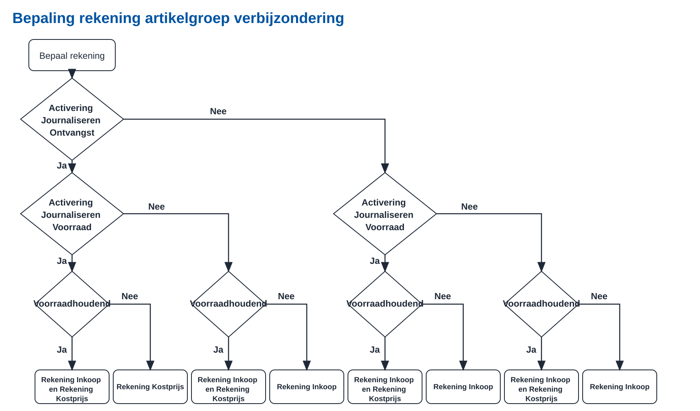

Vanaf Profit 8 is er een aantal wijzigingen in de AFAS Profit API doorgevoerd. Hieronder staan de wijzigingen ten opzichte van Profit 7. Benieuwd naar onze roadmap? [Klik hier](https://www.afas.nl/roadmap)  

> Hoe lees je dit? Profit heeft een omvangrijke API met veel verschillende onderdelen. De API specificaties zijn opgedeeld in onderdelen die bij elkaar horen. Per onderdeel zijn de wijzigingen aangegeven.  

> In de release notes van Profit 7 zijn ook al een aantal wijzigingen doorgevoerd. Deze wijzigingen zijn ook van toepassing op Profit 8. [Klik hier](./news-profit7) voor de release notes van Profit 7.

## ***Breaking* wijzigingen**

### FbPurRequisition stelt hogere eisen aan de verbijzonderingscodes

*(toegevoegd 14-07-2026)*  
Voorheen kon je bij een inkoopaanvraag alle verbijzonderingscodes die er bestaan kiezen. Nu moet de verbijzonderingscode voorkomen in een verbijzonderingstoewijzing van rekening inkoop of rekening kostprijs van de artikelgroep. Zie onderstaand schema. Dit zal in de meeste gevallen geen problemen opleveren, omdat dezelfde verbijzonderingstoewijzing verderop in het proces al aanwezig zou moeten zijn.  

### Taalcodes vereenvoudigd

*(aangepast 06-08-2026)*
T/m Profit 7 kende Profit twee tabellen met taalcodes. Je onderhield de taalcodes die je in Profit gebruikt via `Algemeen / Inrichting / Landinstellingen / Taal`. Per taalcode kon je een ISO-taalcode selecteren. De ISO-taalcodes kon je onderhouden via `Algemeen / Inrichting / Vrije tabel, tabel ISO-taalcode`.  

We hebben dit vereenvoudigd door onder `Algemeen / Inrichting / Landinstellingen / Taal` de volledige Microsoft-taaltabel beschikbaar te stellen. Hierdoor is het zelf toevoegen van talen niet meer nodig. ISO-taalcodes worden niet meer gebruikt.  

Bij bestaande taalcodes wordt de ISO-taalcode automatisch overgenomen in conversie naar Profit 8. Bij alle andere taalcodes is het veld ISO-taalcode niet meer beschikbaar. **Ben je afhankelijk van de ISO-taalcodes in je integraties? Dan is het belangrijk dat je zo snel mogelijk overstapt op de nieuwe taalcodes.**

We streven ernaar dat Imports, Get- en UpdateConnectoren blijven werken. **Het is echter sterk aan te raden zo snel mogelijk over te stappen op de nieuwe taalcodes.**  

Deze aanpassing zie je ook terug in de Changelog van de UpdateConnectoren verderop.  

## Belangrijke wijzigingen

### IP-restricties volgen nu de CIDR notatie

Op een AppConnector kun je IP-restricties instellen. Wij adviseren om dat zoveel mogelijk toe te passen. De IP-restricties kon je voorheen vastleggen als IP-adres met een eventueel subnet-masker. Vanaf Profit 8 leg je meerdere IP-adressen vast met de CIDR notatie.    

### mTLS ondersteuning op de connectoren

*(toegevoegd 16-07-2026)*  
> Dit zal pas beschikbaar komen vanaf september 2026. De UI is erop voorbereid, maar de infrastructuur is nu nog niet beschikbaar.

Vanaf Profit 8 is het mogelijk om mTLS (mutual TLS) te gebruiken op de connectoren. mTLS is een beveiligingsprotocol waarbij zowel de client als de server zich moeten authenticeren met een certificaat. Dit zorgt voor een extra beveiligingslaag, omdat alleen geautoriseerde clients verbinding kunnen maken met de server.  
Dit kun je vooralsnog niet testen op connect.afas.nl.     

### Webhooks!

Een langgekoesterde wens is in vervulling gegaan: Webhooks! [Lees hier meer over Webhooks in Profit](./webhooks).  

## Overige wijzigingen

### BI-modellen respecteren filterautorisatie op definitie

Dit kan tot gevolg hebben dat een aanroep naar de OData-connector na de overgang naar Profit 8 geen resultaten meer oplevert. De filterautorisatie op definitie zorgt ervoor dat gebruikers alleen resultaten terugkrijgen waar ze toegang toe hebben. Controleer of de token-gebruiker de juiste autorisaties heeft om de gewenste resultaten te zien.  

### BI-modellen: acties nieuw, importeren en exporteren apart te autoriseren

De acties Nieuw, Importeren en Exporteren zijn nu autoriseerbaar. Dat kan tot gevolg hebben dat jijzelf of een klant deze acties niet meer ter beschikking heeft.

### Extra talen beschikbaar

Profit ondersteunt vanaf Profit 8 extra talen. Dat geldt zowel voor de User interface alsook voor de Connectoren.  
Dit kun je vooralsnog niet testen op connect.afas.nl.   

### GetConnector toont datum/tijd laatste aanroep

Dit veld was altijd al beschikbaar op de definitie van een GetConnector, maar vanaf Profit 8 wordt het ook werkelijk gevuld. In enkele weergaves is het veld toegevoegd, zodat je bijvoorbeeld vanuit de AppConnector direct kan zien welke GetConnectoren actief aangeroepen worden.  

### IP-restricties nu ook mogelijk op IPv6

Omdat AFAS Online nu IPv6 ondersteunt, is het ook mogelijk om in een AppConnector IP-restricties te maken op IPv6-adressen. Voorheen zorgde een restrictie op een IPv6-adres ervoor dat alle verkeer werd geblokkeerd.  

### Microsoft Entra ID koppeling is nu standaard functionaliteit

Vanaf Profit 8 kun je direct vanuit Profit een koppeling leggen met Microsoft Entra. De koppeling richt je in door op een gebruikersgroep aan te geven welke Entra groep hieraan gekoppeld is. Gebruikers worden automatisch gesynchroniseerd naar Entra op basis van hun groepslidmaatschap.  
Lever jij momenteel een koppeling met Microsoft Entra ID? Lees je dan goed in en bepaal waar jouw meerwaarde ligt ten opzichte van de nieuwe standaard functionaliteit.  

## Artikelen Specification

### All changes

| Connector | Description | Operation |
| --- | --- | --- |
| FbComposition | added the new optional request property `FbComposition/Element/Fields/ABCXYZClass` | [POST](https://docs.afas.help/apidoc/nl/Artikelen#post-/connectors/FbComposition), [PUT](https://docs.afas.help/apidoc/nl/Artikelen#put-/connectors/FbComposition) |
| FbComposition | added the new optional request property `FbComposition/Element/Fields/CCls` | [POST](https://docs.afas.help/apidoc/nl/Artikelen#post-/connectors/FbComposition), [PUT](https://docs.afas.help/apidoc/nl/Artikelen#put-/connectors/FbComposition) |
| FbComposition | added the new optional request property `FbComposition/Element/Fields/PreC` | [POST](https://docs.afas.help/apidoc/nl/Artikelen#post-/connectors/FbComposition), [PUT](https://docs.afas.help/apidoc/nl/Artikelen#put-/connectors/FbComposition) |
| FbItemArticle | added the new optional request property `FbItemArticle/Element/Fields/ABCXYZClass` | [POST](https://docs.afas.help/apidoc/nl/Artikelen#post-/connectors/FbItemArticle), [PUT](https://docs.afas.help/apidoc/nl/Artikelen#put-/connectors/FbItemArticle) |
| FbItemArticle | added the new optional request property `FbItemArticle/Element/Fields/PreC` | [POST](https://docs.afas.help/apidoc/nl/Artikelen#post-/connectors/FbItemArticle), [PUT](https://docs.afas.help/apidoc/nl/Artikelen#put-/connectors/FbItemArticle) |

## Bakkerijen Specification

No changes for this release.

## Bouw Specification

No changes for this release.

## Budgetten en activa Specification

No changes for this release.

## Cursusmanagement Specification

No changes for this release.

## Dossiers en bijlagen en workflows Specification

### All changes

| Connector | Description | Operation |
| --- | --- | --- |
| KnSubject | added the new optional request property `KnSubject/Element/Fields/SubjectHandler` | [POST](https://docs.afas.help/apidoc/nl/Dossiers%20en%20bijlagen%20en%20workflows#post-/connectors/KnSubject), [PUT](https://docs.afas.help/apidoc/nl/Dossiers%20en%20bijlagen%20en%20workflows#put-/connectors/KnSubject) |
| KnSubjectDynamic | added the new optional request property `KnSubjectDynamic/Element/Fields/ProfileId` | [POST](https://docs.afas.help/apidoc/nl/Dossiers%20en%20bijlagen%20en%20workflows#post-/connectors/KnSubjectDynamic), [PUT](https://docs.afas.help/apidoc/nl/Dossiers%20en%20bijlagen%20en%20workflows#put-/connectors/KnSubjectDynamic) |

## Financiële Inrichting Specification

No changes for this release.

## Fiscaal Specification

### All changes

| Connector | Description | Operation |
| --- | --- | --- |
| TxClientIB2021 | the `TxClientIB2021/Element/Objects/KnPerson/Element/Fields/LgId` request property's maxLength was increased from `3` to `5` | [POST](https://docs.afas.help/apidoc/nl/Fiscaal#post-/connectors/TxClientIB2021) |
| TxClientIB2021 | the `TxClientIB2021/Element/Objects/KnPerson/Element/Objects/KnContact/Element/Objects/KnPerson/Element/Fields/LgId` request property's maxLength was increased from `3` to `5` | [POST](https://docs.afas.help/apidoc/nl/Fiscaal#post-/connectors/TxClientIB2021) |
| TxClientIB2022 | the `TxClientIB2022/Element/Objects/KnPerson/Element/Fields/LgId` request property's maxLength was increased from `3` to `5` | [POST](https://docs.afas.help/apidoc/nl/Fiscaal#post-/connectors/TxClientIB2022) |
| TxClientIB2022 | the `TxClientIB2022/Element/Objects/KnPerson/Element/Objects/KnContact/Element/Objects/KnPerson/Element/Fields/LgId` request property's maxLength was increased from `3` to `5` | [POST](https://docs.afas.help/apidoc/nl/Fiscaal#post-/connectors/TxClientIB2022) |
| TxClientIB2023 | the `TxClientIB2023/Element/Objects/KnPerson/Element/Fields/LgId` request property's maxLength was increased from `3` to `5` | [POST](https://docs.afas.help/apidoc/nl/Fiscaal#post-/connectors/TxClientIB2023) |
| TxClientIB2023 | the `TxClientIB2023/Element/Objects/KnPerson/Element/Objects/KnContact/Element/Objects/KnPerson/Element/Fields/LgId` request property's maxLength was increased from `3` to `5` | [POST](https://docs.afas.help/apidoc/nl/Fiscaal#post-/connectors/TxClientIB2023) |
| TxClientIB2024 | the `TxClientIB2024/Element/Objects/KnPerson/Element/Fields/LgId` request property's maxLength was increased from `3` to `5` | [POST](https://docs.afas.help/apidoc/nl/Fiscaal#post-/connectors/TxClientIB2024) |
| TxClientIB2024 | the `TxClientIB2024/Element/Objects/KnPerson/Element/Objects/KnContact/Element/Objects/KnPerson/Element/Fields/LgId` request property's maxLength was increased from `3` to `5` | [POST](https://docs.afas.help/apidoc/nl/Fiscaal#post-/connectors/TxClientIB2024) |
| TxClientIB2025 | the `TxClientIB2025/Element/Objects/KnPerson/Element/Fields/LgId` request property's maxLength was increased from `3` to `5` | [POST](https://docs.afas.help/apidoc/nl/Fiscaal#post-/connectors/TxClientIB2025) |
| TxClientIB2025 | the `TxClientIB2025/Element/Objects/KnPerson/Element/Objects/KnContact/Element/Objects/KnPerson/Element/Fields/LgId` request property's maxLength was increased from `3` to `5` | [POST](https://docs.afas.help/apidoc/nl/Fiscaal#post-/connectors/TxClientIB2025) |
| TxClientVpb2021 | the `TxClientVpb2021/Element/Objects/KnOrganisation/Element/Fields/LgId` request property's maxLength was increased from `3` to `5` | [POST](https://docs.afas.help/apidoc/nl/Fiscaal#post-/connectors/TxClientVpb2021) |
| TxClientVpb2021 | the `TxClientVpb2021/Element/Objects/KnOrganisation/Element/Objects/KnContact/Element/Objects/KnPerson/Element/Fields/LgId` request property's maxLength was increased from `3` to `5` | [POST](https://docs.afas.help/apidoc/nl/Fiscaal#post-/connectors/TxClientVpb2021) |
| TxClientVpb2022 | the `TxClientVpb2022/Element/Objects/KnOrganisation/Element/Fields/LgId` request property's maxLength was increased from `3` to `5` | [POST](https://docs.afas.help/apidoc/nl/Fiscaal#post-/connectors/TxClientVpb2022) |
| TxClientVpb2022 | the `TxClientVpb2022/Element/Objects/KnOrganisation/Element/Objects/KnContact/Element/Objects/KnPerson/Element/Fields/LgId` request property's maxLength was increased from `3` to `5` | [POST](https://docs.afas.help/apidoc/nl/Fiscaal#post-/connectors/TxClientVpb2022) |
| TxClientVpb2023 | the `TxClientVpb2023/Element/Objects/KnOrganisation/Element/Fields/LgId` request property's maxLength was increased from `3` to `5` | [POST](https://docs.afas.help/apidoc/nl/Fiscaal#post-/connectors/TxClientVpb2023) |
| TxClientVpb2023 | the `TxClientVpb2023/Element/Objects/KnOrganisation/Element/Objects/KnContact/Element/Objects/KnPerson/Element/Fields/LgId` request property's maxLength was increased from `3` to `5` | [POST](https://docs.afas.help/apidoc/nl/Fiscaal#post-/connectors/TxClientVpb2023) |
| TxClientVpb2024 | the `TxClientVpb2024/Element/Objects/KnOrganisation/Element/Fields/LgId` request property's maxLength was increased from `3` to `5` | [POST](https://docs.afas.help/apidoc/nl/Fiscaal#post-/connectors/TxClientVpb2024) |
| TxClientVpb2024 | the `TxClientVpb2024/Element/Objects/KnOrganisation/Element/Objects/KnContact/Element/Objects/KnPerson/Element/Fields/LgId` request property's maxLength was increased from `3` to `5` | [POST](https://docs.afas.help/apidoc/nl/Fiscaal#post-/connectors/TxClientVpb2024) |
| TxClientVpb2025 | the `TxClientVpb2025/Element/Objects/KnOrganisation/Element/Fields/LgId` request property's maxLength was increased from `3` to `5` | [POST](https://docs.afas.help/apidoc/nl/Fiscaal#post-/connectors/TxClientVpb2025) |
| TxClientVpb2025 | the `TxClientVpb2025/Element/Objects/KnOrganisation/Element/Objects/KnContact/Element/Objects/KnPerson/Element/Fields/LgId` request property's maxLength was increased from `3` to `5` | [POST](https://docs.afas.help/apidoc/nl/Fiscaal#post-/connectors/TxClientVpb2025) |

## Flex Specification

### All changes

| Connector | Description | Operation |
| --- | --- | --- |
| PtDeclarationCorrection | added the new optional request property `PtDeclarationCorrection/Element/Fields/RsCr` | [POST](https://docs.afas.help/apidoc/nl/Flex#post-/connectors/PtDeclarationCorrection), [PUT](https://docs.afas.help/apidoc/nl/Flex#put-/connectors/PtDeclarationCorrection) |

## Inkoop Specification

### All changes

| Connector | Description | Operation |
| --- | --- | --- |
| FbGoodsReceived | the `FbGoodsReceived/Element/Fields/LgId` request property's maxLength was increased from `3` to `5` | [POST](https://docs.afas.help/apidoc/nl/Inkoop#post-/connectors/FbGoodsReceived), [PUT](https://docs.afas.help/apidoc/nl/Inkoop#put-/connectors/FbGoodsReceived) |
| FbPurch | added new enum value(s) to the request property `FbPurch/Element/Fields/PuMe`:  `4` | [POST](https://docs.afas.help/apidoc/nl/Inkoop#post-/connectors/FbPurch), [PUT](https://docs.afas.help/apidoc/nl/Inkoop#put-/connectors/FbPurch) |
| FbPurch | the `FbPurch/Element/Fields/LgId` request property's maxLength was increased from `3` to `5` | [POST](https://docs.afas.help/apidoc/nl/Inkoop#post-/connectors/FbPurch), [PUT](https://docs.afas.help/apidoc/nl/Inkoop#put-/connectors/FbPurch) |
| FbPurchQuotation | the `FbPurchQuotation/Element/Fields/LgId` request property's maxLength was increased from `3` to `5` | [POST](https://docs.afas.help/apidoc/nl/Inkoop#post-/connectors/FbPurchQuotation), [PUT](https://docs.afas.help/apidoc/nl/Inkoop#put-/connectors/FbPurchQuotation) |
| KnPurchaseRelationOrg | added the new optional request property `KnPurchaseRelationOrg/Element/Fields/PoCo` | [POST](https://docs.afas.help/apidoc/nl/Inkoop#post-/connectors/KnPurchaseRelationOrg), [PUT](https://docs.afas.help/apidoc/nl/Inkoop#put-/connectors/KnPurchaseRelationOrg) |
| KnPurchaseRelationOrg | the `KnPurchaseRelationOrg/Element/Fields/LgId` request property's maxLength was increased from `3` to `5` | [POST](https://docs.afas.help/apidoc/nl/Inkoop#post-/connectors/KnPurchaseRelationOrg), [PUT](https://docs.afas.help/apidoc/nl/Inkoop#put-/connectors/KnPurchaseRelationOrg) |
| KnPurchaseRelationPer | added the new optional request property `KnPurchaseRelationPer/Element/Fields/PoCo` | [POST](https://docs.afas.help/apidoc/nl/Inkoop#post-/connectors/KnPurchaseRelationPer), [PUT](https://docs.afas.help/apidoc/nl/Inkoop#put-/connectors/KnPurchaseRelationPer) |
| KnPurchaseRelationPer | the `KnPurchaseRelationPer/Element/Fields/LgId` request property's maxLength was increased from `3` to `5` | [POST](https://docs.afas.help/apidoc/nl/Inkoop#post-/connectors/KnPurchaseRelationPer), [PUT](https://docs.afas.help/apidoc/nl/Inkoop#put-/connectors/KnPurchaseRelationPer) |

## Inrichting Specification

### All changes

No changes for this release.

## Loonadministratie Specification

No changes for this release.

## Magazijn Specification

### All changes

| Connector | Description | Operation |
| --- | --- | --- |
| FbGoodsReceived | the `FbGoodsReceived/Element/Fields/LgId` request property's maxLength was increased from `3` to `5` | [POST](https://docs.afas.help/apidoc/nl/Magazijn#post-/connectors/FbGoodsReceived), [PUT](https://docs.afas.help/apidoc/nl/Magazijn#put-/connectors/FbGoodsReceived) |
| FbWarTransferIn | the `FbWarTransferIn/Element/Fields/LgId` request property's maxLength was increased from `3` to `5` | [POST](https://docs.afas.help/apidoc/nl/Magazijn#post-/connectors/FbWarTransferIn), [PUT](https://docs.afas.help/apidoc/nl/Magazijn#put-/connectors/FbWarTransferIn) |
| FbWarTransferOut | the `FbWarTransferOut/Element/Fields/LgId` request property's maxLength was increased from `3` to `5` | [POST](https://docs.afas.help/apidoc/nl/Magazijn#post-/connectors/FbWarTransferOut), [PUT](https://docs.afas.help/apidoc/nl/Magazijn#put-/connectors/FbWarTransferOut) |
| FbWarTransferPrep | the `FbWarTransferPrep/Element/Fields/LgId` request property's maxLength was increased from `3` to `5` | [POST](https://docs.afas.help/apidoc/nl/Magazijn#post-/connectors/FbWarTransferPrep), [PUT](https://docs.afas.help/apidoc/nl/Magazijn#put-/connectors/FbWarTransferPrep) |

## Medewerker en contract Specification

### Breaking changes

| Connector | Description | Operation |
| --- | --- | --- |
| KnEmployee | removed enum value(s) from the request property `AfasEmployee/Element/Objects/AfasIdentityDocument/Element/Fields/ViTt`:  `ABS`, `AGB`, `BIG`, `Bestuurderskaart`, `Chauffeurskaart`, `DTO`, `EU`, `FGzPT`, `FM`, `GD`, `GHV`, `Geneesk. verklaring`, `Hepatitis B register`, `ID`, `KNMG`, `KNMG-specialisten`, `Kenncn. Kraamz toev.`, `Kwal.reg. paramedici`, `LHV`, `Logo verklaring`, `NVO/NIP`, `OO`, `OV`, `P`, `POH-register`, `RBW`, `RGS`, `Reg. gev. apothekers`, `Registerplein`, `SKJ`, `SO`, `ST`, `T`, `V1`, `V2`, `V3`, `V4`, `V5`, `VCA`, `VI`, `VK`, `VOG`, `VVN`, `Vaktherapie` | [POST](https://docs.afas.help/apidoc/nl/Medewerker%20en%20contract#post-/connectors/KnEmployee), [PUT](https://docs.afas.help/apidoc/nl/Medewerker%20en%20contract#put-/connectors/KnEmployee) |
| KnEmployee | removed enum value(s) from the request property `AfasEmployee/Element/Objects/AfasResidenceDocument/Element/Fields/ViTt`:  `ABS`, `AGB`, `BIG`, `Bestuurderskaart`, `Chauffeurskaart`, `DTO`, `EU`, `FGzPT`, `FM`, `GD`, `GHV`, `Geneesk. verklaring`, `Hepatitis B register`, `ID`, `KNMG`, `KNMG-specialisten`, `Kenncn. Kraamz toev.`, `Kwal.reg. paramedici`, `LHV`, `Logo verklaring`, `NVO/NIP`, `OO`, `OV`, `P`, `POH-register`, `RBW`, `RGS`, `Reg. gev. apothekers`, `Registerplein`, `SKJ`, `SO`, `ST`, `T`, `V1`, `V2`, `V3`, `V4`, `V5`, `VCA`, `VI`, `VK`, `VOG`, `VVN`, `Vaktherapie` | [POST](https://docs.afas.help/apidoc/nl/Medewerker%20en%20contract#post-/connectors/KnEmployee), [PUT](https://docs.afas.help/apidoc/nl/Medewerker%20en%20contract#put-/connectors/KnEmployee) |
| KnEmployee | the `AfasEmployee/Element/Objects/AfasIdentityDocument/Element/Fields/ViTt` request property's maxLength was decreased to `3` | [POST](https://docs.afas.help/apidoc/nl/Medewerker%20en%20contract#post-/connectors/KnEmployee), [PUT](https://docs.afas.help/apidoc/nl/Medewerker%20en%20contract#put-/connectors/KnEmployee) |
| KnEmployee | the `AfasEmployee/Element/Objects/AfasResidenceDocument/Element/Fields/ViTt` request property's maxLength was decreased to `3` | [POST](https://docs.afas.help/apidoc/nl/Medewerker%20en%20contract#post-/connectors/KnEmployee), [PUT](https://docs.afas.help/apidoc/nl/Medewerker%20en%20contract#put-/connectors/KnEmployee) |
| KnEmployeeGUID | added the new required request property `AfasEmployee/Element/Objects/AfasContract/Element/Fields/DvbDvCh` | [POST](https://docs.afas.help/apidoc/nl/Medewerker%20en%20contract#post-/connectors/KnEmployeeGUID) |
| KnEmployeeGUID | added the new required request property `AfasEmployee/Element/Objects/AfasOrgunitFunction/Element/Objects/AfasSalaryCost/Element/Fields/TdSn` | [POST](https://docs.afas.help/apidoc/nl/Medewerker%20en%20contract#post-/connectors/KnEmployeeGUID), [PUT](https://docs.afas.help/apidoc/nl/Medewerker%20en%20contract#put-/connectors/KnEmployeeGUID) |
| KnEmployeeGUID | removed enum value(s) from the request property `AfasEmployee/Element/Objects/AfasIdentityDocument/Element/Fields/ViTt`:  `ABS`, `AGB`, `BIG`, `Bestuurderskaart`, `Chauffeurskaart`, `DTO`, `EU`, `FGzPT`, `FM`, `GD`, `GHV`, `Geneesk. verklaring`, `Hepatitis B register`, `ID`, `KNMG`, `KNMG-specialisten`, `Kenncn. Kraamz toev.`, `Kwal.reg. paramedici`, `LHV`, `Logo verklaring`, `NVO/NIP`, `OO`, `OV`, `P`, `POH-register`, `RBW`, `RGS`, `Reg. gev. apothekers`, `Registerplein`, `SKJ`, `SO`, `ST`, `T`, `V1`, `V2`, `V3`, `V4`, `V5`, `VCA`, `VI`, `VK`, `VOG`, `VVN`, `Vaktherapie` | [POST](https://docs.afas.help/apidoc/nl/Medewerker%20en%20contract#post-/connectors/KnEmployeeGUID), [PUT](https://docs.afas.help/apidoc/nl/Medewerker%20en%20contract#put-/connectors/KnEmployeeGUID) |
| KnEmployeeGUID | removed enum value(s) from the request property `AfasEmployee/Element/Objects/AfasResidenceDocument/Element/Fields/ViTt`:  `ABS`, `AGB`, `BIG`, `Bestuurderskaart`, `Chauffeurskaart`, `DTO`, `EU`, `FGzPT`, `FM`, `GD`, `GHV`, `Geneesk. verklaring`, `Hepatitis B register`, `ID`, `KNMG`, `KNMG-specialisten`, `Kenncn. Kraamz toev.`, `Kwal.reg. paramedici`, `LHV`, `Logo verklaring`, `NVO/NIP`, `OO`, `OV`, `P`, `POH-register`, `RBW`, `RGS`, `Reg. gev. apothekers`, `Registerplein`, `SKJ`, `SO`, `ST`, `T`, `V1`, `V2`, `V3`, `V4`, `V5`, `VCA`, `VI`, `VK`, `VOG`, `VVN`, `Vaktherapie` | [POST](https://docs.afas.help/apidoc/nl/Medewerker%20en%20contract#post-/connectors/KnEmployeeGUID), [PUT](https://docs.afas.help/apidoc/nl/Medewerker%20en%20contract#put-/connectors/KnEmployeeGUID) |
| KnEmployeeGUID | the `AfasEmployee/Element/Objects/AfasIdentityDocument/Element/Fields/ViTt` request property's maxLength was decreased to `3` | [POST](https://docs.afas.help/apidoc/nl/Medewerker%20en%20contract#post-/connectors/KnEmployeeGUID), [PUT](https://docs.afas.help/apidoc/nl/Medewerker%20en%20contract#put-/connectors/KnEmployeeGUID) |
| KnEmployeeGUID | the `AfasEmployee/Element/Objects/AfasResidenceDocument/Element/Fields/ViTt` request property's maxLength was decreased to `3` | [POST](https://docs.afas.help/apidoc/nl/Medewerker%20en%20contract#post-/connectors/KnEmployeeGUID), [PUT](https://docs.afas.help/apidoc/nl/Medewerker%20en%20contract#put-/connectors/KnEmployeeGUID) |
| KnEmployeeGUID | removed the request property `AfasEmployee/Element/Objects/AfasResidenceDocument/Element/Objects/AfasResidenceAttachment` | [POST](https://docs.afas.help/apidoc/nl/Medewerker%20en%20contract#post-/connectors/KnEmployeeGUID), [PUT](https://docs.afas.help/apidoc/nl/Medewerker%20en%20contract#put-/connectors/KnEmployeeGUID) |

### All changes

| Connector | Description | Operation |
| --- | --- | --- |
| KnEmployee | added the new optional request property `AfasEmployee/Element/Fields/Isle` | [POST](https://docs.afas.help/apidoc/nl/Medewerker%20en%20contract#post-/connectors/KnEmployee), [PUT](https://docs.afas.help/apidoc/nl/Medewerker%20en%20contract#put-/connectors/KnEmployee) |
| KnEmployee | added the new optional request property `AfasEmployee/Element/Objects/AfasAgencyABP/Element/Fields/NoDl` | [POST](https://docs.afas.help/apidoc/nl/Medewerker%20en%20contract#post-/connectors/KnEmployee), [PUT](https://docs.afas.help/apidoc/nl/Medewerker%20en%20contract#put-/connectors/KnEmployee) |
| KnEmployee | added the new optional request property `AfasEmployee/Element/Objects/AfasAgencyAcerta/Element/Fields/DiPa` | [POST](https://docs.afas.help/apidoc/nl/Medewerker%20en%20contract#post-/connectors/KnEmployee), [PUT](https://docs.afas.help/apidoc/nl/Medewerker%20en%20contract#put-/connectors/KnEmployee) |
| KnEmployee | added the new optional request property `AfasEmployee/Element/Objects/AfasAgencyFiscus/Element/Fields/Loan` | [POST](https://docs.afas.help/apidoc/nl/Medewerker%20en%20contract#post-/connectors/KnEmployee), [PUT](https://docs.afas.help/apidoc/nl/Medewerker%20en%20contract#put-/connectors/KnEmployee) |
| KnEmployee | added the new optional request property `AfasEmployee/Element/Objects/AfasAgencyFiscus/Element/Fields/OuVr` | [POST](https://docs.afas.help/apidoc/nl/Medewerker%20en%20contract#post-/connectors/KnEmployee), [PUT](https://docs.afas.help/apidoc/nl/Medewerker%20en%20contract#put-/connectors/KnEmployee) |
| KnEmployee | added the new optional request property `AfasEmployee/Element/Objects/AfasTimeTable/Element/Fields/WsTC` | [POST](https://docs.afas.help/apidoc/nl/Medewerker%20en%20contract#post-/connectors/KnEmployee), [PUT](https://docs.afas.help/apidoc/nl/Medewerker%20en%20contract#put-/connectors/KnEmployee) |
| KnEmployee | added the new optional request property `AfasEmployee/Element/Objects/KnPerson/Element/Objects/KnBankAccount/Element/Fields/AcGa` | [POST](https://docs.afas.help/apidoc/nl/Medewerker%20en%20contract#post-/connectors/KnEmployee), [PUT](https://docs.afas.help/apidoc/nl/Medewerker%20en%20contract#put-/connectors/KnEmployee) |
| KnEmployee | added new enum value(s) to the request property `AfasEmployee/Element/Objects/AfasContract/Element/Fields/ViAc`:  `04`, `05`, `06`, `07` | [POST](https://docs.afas.help/apidoc/nl/Medewerker%20en%20contract#post-/connectors/KnEmployee), [PUT](https://docs.afas.help/apidoc/nl/Medewerker%20en%20contract#put-/connectors/KnEmployee) |
| KnEmployee | removed enum value(s) from the request property `AfasEmployee/Element/Objects/AfasIdentityDocument/Element/Fields/ViTt`:  `ABS`, `AGB`, `BIG`, `Bestuurderskaart`, `Chauffeurskaart`, `DTO`, `EU`, `FGzPT`, `FM`, `GD`, `GHV`, `Geneesk. verklaring`, `Hepatitis B register`, `ID`, `KNMG`, `KNMG-specialisten`, `Kenncn. Kraamz toev.`, `Kwal.reg. paramedici`, `LHV`, `Logo verklaring`, `NVO/NIP`, `OO`, `OV`, `P`, `POH-register`, `RBW`, `RGS`, `Reg. gev. apothekers`, `Registerplein`, `SKJ`, `SO`, `ST`, `T`, `V1`, `V2`, `V3`, `V4`, `V5`, `VCA`, `VI`, `VK`, `VOG`, `VVN`, `Vaktherapie` | [POST](https://docs.afas.help/apidoc/nl/Medewerker%20en%20contract#post-/connectors/KnEmployee), [PUT](https://docs.afas.help/apidoc/nl/Medewerker%20en%20contract#put-/connectors/KnEmployee) |
| KnEmployee | removed enum value(s) from the request property `AfasEmployee/Element/Objects/AfasResidenceDocument/Element/Fields/ViTt`:  `ABS`, `AGB`, `BIG`, `Bestuurderskaart`, `Chauffeurskaart`, `DTO`, `EU`, `FGzPT`, `FM`, `GD`, `GHV`, `Geneesk. verklaring`, `Hepatitis B register`, `ID`, `KNMG`, `KNMG-specialisten`, `Kenncn. Kraamz toev.`, `Kwal.reg. paramedici`, `LHV`, `Logo verklaring`, `NVO/NIP`, `OO`, `OV`, `P`, `POH-register`, `RBW`, `RGS`, `Reg. gev. apothekers`, `Registerplein`, `SKJ`, `SO`, `ST`, `T`, `V1`, `V2`, `V3`, `V4`, `V5`, `VCA`, `VI`, `VK`, `VOG`, `VVN`, `Vaktherapie` | [POST](https://docs.afas.help/apidoc/nl/Medewerker%20en%20contract#post-/connectors/KnEmployee), [PUT](https://docs.afas.help/apidoc/nl/Medewerker%20en%20contract#put-/connectors/KnEmployee) |
| KnEmployee | the `AfasEmployee/Element/Objects/AfasIdentityDocument/Element/Fields/ViTt` request property's maxLength was decreased to `3` | [POST](https://docs.afas.help/apidoc/nl/Medewerker%20en%20contract#post-/connectors/KnEmployee), [PUT](https://docs.afas.help/apidoc/nl/Medewerker%20en%20contract#put-/connectors/KnEmployee) |
| KnEmployee | the `AfasEmployee/Element/Objects/AfasResidenceDocument/Element/Fields/ViTt` request property's maxLength was decreased to `3` | [POST](https://docs.afas.help/apidoc/nl/Medewerker%20en%20contract#post-/connectors/KnEmployee), [PUT](https://docs.afas.help/apidoc/nl/Medewerker%20en%20contract#put-/connectors/KnEmployee) |
| KnEmployee | the `AfasEmployee/Element/Fields/LgId` request property's maxLength was increased from `3` to `5` | [POST](https://docs.afas.help/apidoc/nl/Medewerker%20en%20contract#post-/connectors/KnEmployee), [PUT](https://docs.afas.help/apidoc/nl/Medewerker%20en%20contract#put-/connectors/KnEmployee) |
| KnEmployee | the `AfasEmployee/Element/Objects/KnPerson/Element/Fields/LgId` request property's maxLength was increased from `3` to `5` | [POST](https://docs.afas.help/apidoc/nl/Medewerker%20en%20contract#post-/connectors/KnEmployee), [PUT](https://docs.afas.help/apidoc/nl/Medewerker%20en%20contract#put-/connectors/KnEmployee) |
| KnEmployeeGUID | added the new optional request property `AfasEmployee/Element/Fields/Isle` | [POST](https://docs.afas.help/apidoc/nl/Medewerker%20en%20contract#post-/connectors/KnEmployeeGUID), [PUT](https://docs.afas.help/apidoc/nl/Medewerker%20en%20contract#put-/connectors/KnEmployeeGUID) |
| KnEmployeeGUID | added the new optional request property `AfasEmployee/Element/Objects/AfasAgencyFiscus/Element/Fields/CoDi` | [POST](https://docs.afas.help/apidoc/nl/Medewerker%20en%20contract#post-/connectors/KnEmployeeGUID), [PUT](https://docs.afas.help/apidoc/nl/Medewerker%20en%20contract#put-/connectors/KnEmployeeGUID) |
| KnEmployeeGUID | added the new optional request property `AfasEmployee/Element/Objects/AfasAgencyFiscus/Element/Fields/TyDt` | [POST](https://docs.afas.help/apidoc/nl/Medewerker%20en%20contract#post-/connectors/KnEmployeeGUID), [PUT](https://docs.afas.help/apidoc/nl/Medewerker%20en%20contract#put-/connectors/KnEmployeeGUID) |
| KnEmployeeGUID | added the new optional request property `AfasEmployee/Element/Objects/AfasBankInfo/Element/Fields/DsTp` | [POST](https://docs.afas.help/apidoc/nl/Medewerker%20en%20contract#post-/connectors/KnEmployeeGUID), [PUT](https://docs.afas.help/apidoc/nl/Medewerker%20en%20contract#put-/connectors/KnEmployeeGUID) |
| KnEmployeeGUID | added the new optional request property `AfasEmployee/Element/Objects/AfasContract/Element/Fields/BrMo` | [POST](https://docs.afas.help/apidoc/nl/Medewerker%20en%20contract#post-/connectors/KnEmployeeGUID), [PUT](https://docs.afas.help/apidoc/nl/Medewerker%20en%20contract#put-/connectors/KnEmployeeGUID) |
| KnEmployeeGUID | added the new optional request property `AfasEmployee/Element/Objects/AfasContract/Element/Fields/DvbDvCh` | [PUT](https://docs.afas.help/apidoc/nl/Medewerker%20en%20contract#put-/connectors/KnEmployeeGUID) |
| KnEmployeeGUID | added the new optional request property `AfasEmployee/Element/Objects/AfasResidenceDocument/Element/Objects/AfasResidenceDocumentAttachment` | [POST](https://docs.afas.help/apidoc/nl/Medewerker%20en%20contract#post-/connectors/KnEmployeeGUID), [PUT](https://docs.afas.help/apidoc/nl/Medewerker%20en%20contract#put-/connectors/KnEmployeeGUID) |
| KnEmployeeGUID | added the new optional request property `AfasEmployee/Element/Objects/AfasTimeTable/Element/Fields/WsTC` | [POST](https://docs.afas.help/apidoc/nl/Medewerker%20en%20contract#post-/connectors/KnEmployeeGUID), [PUT](https://docs.afas.help/apidoc/nl/Medewerker%20en%20contract#put-/connectors/KnEmployeeGUID) |
| KnEmployeeGUID | added the new optional request property `AfasEmployee/Element/Objects/KnPerson/Element/Fields/FileId` | [POST](https://docs.afas.help/apidoc/nl/Medewerker%20en%20contract#post-/connectors/KnEmployeeGUID), [PUT](https://docs.afas.help/apidoc/nl/Medewerker%20en%20contract#put-/connectors/KnEmployeeGUID) |
| KnEmployeeGUID | added the new optional request property `AfasEmployee/Element/Objects/KnPerson/Element/Objects/KnBankAccount/Element/Fields/BkIc` | [POST](https://docs.afas.help/apidoc/nl/Medewerker%20en%20contract#post-/connectors/KnEmployeeGUID), [PUT](https://docs.afas.help/apidoc/nl/Medewerker%20en%20contract#put-/connectors/KnEmployeeGUID) |
| KnEmployeeGUID | added the new optional request property `AfasEmployee/Element/Objects/KnPerson/Element/Objects/KnBankAccount/Element/Fields/BkTp` | [POST](https://docs.afas.help/apidoc/nl/Medewerker%20en%20contract#post-/connectors/KnEmployeeGUID), [PUT](https://docs.afas.help/apidoc/nl/Medewerker%20en%20contract#put-/connectors/KnEmployeeGUID) |
| KnEmployeeGUID | added the new required request property `AfasEmployee/Element/Objects/AfasContract/Element/Fields/DvbDvCh` | [POST](https://docs.afas.help/apidoc/nl/Medewerker%20en%20contract#post-/connectors/KnEmployeeGUID) |
| KnEmployeeGUID | added the new required request property `AfasEmployee/Element/Objects/AfasOrgunitFunction/Element/Objects/AfasSalaryCost/Element/Fields/TdSn` | [POST](https://docs.afas.help/apidoc/nl/Medewerker%20en%20contract#post-/connectors/KnEmployeeGUID), [PUT](https://docs.afas.help/apidoc/nl/Medewerker%20en%20contract#put-/connectors/KnEmployeeGUID) |
| KnEmployeeGUID | added new enum value(s) to the request property `AfasEmployee/Element/Objects/AfasContract/Element/Fields/ViAc`:  `04`, `05`, `06`, `07` | [POST](https://docs.afas.help/apidoc/nl/Medewerker%20en%20contract#post-/connectors/KnEmployeeGUID), [PUT](https://docs.afas.help/apidoc/nl/Medewerker%20en%20contract#put-/connectors/KnEmployeeGUID) |
| KnEmployeeGUID | removed enum value(s) from the request property `AfasEmployee/Element/Objects/AfasIdentityDocument/Element/Fields/ViTt`:  `ABS`, `AGB`, `BIG`, `Bestuurderskaart`, `Chauffeurskaart`, `DTO`, `EU`, `FGzPT`, `FM`, `GD`, `GHV`, `Geneesk. verklaring`, `Hepatitis B register`, `ID`, `KNMG`, `KNMG-specialisten`, `Kenncn. Kraamz toev.`, `Kwal.reg. paramedici`, `LHV`, `Logo verklaring`, `NVO/NIP`, `OO`, `OV`, `P`, `POH-register`, `RBW`, `RGS`, `Reg. gev. apothekers`, `Registerplein`, `SKJ`, `SO`, `ST`, `T`, `V1`, `V2`, `V3`, `V4`, `V5`, `VCA`, `VI`, `VK`, `VOG`, `VVN`, `Vaktherapie` | [POST](https://docs.afas.help/apidoc/nl/Medewerker%20en%20contract#post-/connectors/KnEmployeeGUID), [PUT](https://docs.afas.help/apidoc/nl/Medewerker%20en%20contract#put-/connectors/KnEmployeeGUID) |
| KnEmployeeGUID | removed enum value(s) from the request property `AfasEmployee/Element/Objects/AfasResidenceDocument/Element/Fields/ViTt`:  `ABS`, `AGB`, `BIG`, `Bestuurderskaart`, `Chauffeurskaart`, `DTO`, `EU`, `FGzPT`, `FM`, `GD`, `GHV`, `Geneesk. verklaring`, `Hepatitis B register`, `ID`, `KNMG`, `KNMG-specialisten`, `Kenncn. Kraamz toev.`, `Kwal.reg. paramedici`, `LHV`, `Logo verklaring`, `NVO/NIP`, `OO`, `OV`, `P`, `POH-register`, `RBW`, `RGS`, `Reg. gev. apothekers`, `Registerplein`, `SKJ`, `SO`, `ST`, `T`, `V1`, `V2`, `V3`, `V4`, `V5`, `VCA`, `VI`, `VK`, `VOG`, `VVN`, `Vaktherapie` | [POST](https://docs.afas.help/apidoc/nl/Medewerker%20en%20contract#post-/connectors/KnEmployeeGUID), [PUT](https://docs.afas.help/apidoc/nl/Medewerker%20en%20contract#put-/connectors/KnEmployeeGUID) |
| KnEmployeeGUID | the `AfasEmployee/Element/Objects/AfasIdentityDocument/Element/Fields/ViTt` request property's maxLength was decreased to `3` | [POST](https://docs.afas.help/apidoc/nl/Medewerker%20en%20contract#post-/connectors/KnEmployeeGUID), [PUT](https://docs.afas.help/apidoc/nl/Medewerker%20en%20contract#put-/connectors/KnEmployeeGUID) |
| KnEmployeeGUID | the `AfasEmployee/Element/Objects/AfasResidenceDocument/Element/Fields/ViTt` request property's maxLength was decreased to `3` | [POST](https://docs.afas.help/apidoc/nl/Medewerker%20en%20contract#post-/connectors/KnEmployeeGUID), [PUT](https://docs.afas.help/apidoc/nl/Medewerker%20en%20contract#put-/connectors/KnEmployeeGUID) |
| KnEmployeeGUID | the `AfasEmployee/Element/Fields/LgId` request property's maxLength was increased from `3` to `5` | [POST](https://docs.afas.help/apidoc/nl/Medewerker%20en%20contract#post-/connectors/KnEmployeeGUID), [PUT](https://docs.afas.help/apidoc/nl/Medewerker%20en%20contract#put-/connectors/KnEmployeeGUID) |
| KnEmployeeGUID | the `AfasEmployee/Element/Objects/KnPerson/Element/Fields/LgId` request property's maxLength was increased from `3` to `5` | [POST](https://docs.afas.help/apidoc/nl/Medewerker%20en%20contract#post-/connectors/KnEmployeeGUID), [PUT](https://docs.afas.help/apidoc/nl/Medewerker%20en%20contract#put-/connectors/KnEmployeeGUID) |
| KnEmployeeGUID | removed the request property `AfasEmployee/Element/Objects/AfasResidenceDocument/Element/Objects/AfasResidenceAttachment` | [POST](https://docs.afas.help/apidoc/nl/Medewerker%20en%20contract#post-/connectors/KnEmployeeGUID), [PUT](https://docs.afas.help/apidoc/nl/Medewerker%20en%20contract#put-/connectors/KnEmployeeGUID) |
| KnOrgEmrFun | added the new optional request property `KnOrgEmrFun/Element/Fields/FcId` | [POST](https://docs.afas.help/apidoc/nl/Medewerker%20en%20contract#post-/connectors/KnOrgEmrFun), [PUT](https://docs.afas.help/apidoc/nl/Medewerker%20en%20contract#put-/connectors/KnOrgEmrFun) |

## Mutaties Specification

### Breaking changes

| Connector | Description | Operation |
| --- | --- | --- |
| FiInvoice | removed enum value(s) from the request property `FiInvoice/Element/Fields/DeDu`:  `RSZ` | [PUT](https://docs.afas.help/apidoc/nl/Mutaties#put-/connectors/FiInvoice) |

### All changes

| Connector | Description | Operation |
| --- | --- | --- |
| FiEntries | added the new optional request property `FiEntryPar/Element/Objects/FiEntries/Element/Fields/InI2` | [POST](https://docs.afas.help/apidoc/nl/Mutaties#post-/connectors/FiEntries) |
| FiEntries | added the new optional request property `FiEntryPar/Element/Objects/FiEntries/Element/Fields/PoCo` | [POST](https://docs.afas.help/apidoc/nl/Mutaties#post-/connectors/FiEntries) |
| FiInvoice | added the new optional request property `FiInvoice/Element/Fields/PoCo` | [PUT](https://docs.afas.help/apidoc/nl/Mutaties#put-/connectors/FiInvoice) |
| FiInvoice | added new enum value(s) to the request property `FiInvoice/Element/Fields/DeDu`:  `RSZ/RSVZ` | [PUT](https://docs.afas.help/apidoc/nl/Mutaties#put-/connectors/FiInvoice) |
| FiInvoice | removed enum value(s) from the request property `FiInvoice/Element/Fields/DeDu`:  `RSZ` | [PUT](https://docs.afas.help/apidoc/nl/Mutaties#put-/connectors/FiInvoice) |

## Organisaties en personen Specification

### All changes

| Connector | Description | Operation |
| --- | --- | --- |
| KnOrganisation | the `KnOrganisation/Element/Fields/LgId` request property's maxLength was increased from `3` to `5` | [POST](https://docs.afas.help/apidoc/nl/Organisaties%20en%20personen#post-/connectors/KnOrganisation), [PUT](https://docs.afas.help/apidoc/nl/Organisaties%20en%20personen#put-/connectors/KnOrganisation) |
| KnOrganisation | the `KnOrganisation/Element/Objects/KnContact/Element/Objects/KnPerson/Element/Fields/LgId` request property's maxLength was increased from `3` to `5` | [POST](https://docs.afas.help/apidoc/nl/Organisaties%20en%20personen#post-/connectors/KnOrganisation), [PUT](https://docs.afas.help/apidoc/nl/Organisaties%20en%20personen#put-/connectors/KnOrganisation) |
| KnPerson | the `KnPerson/Element/Fields/LgId` request property's maxLength was increased from `3` to `5` | [POST](https://docs.afas.help/apidoc/nl/Organisaties%20en%20personen#post-/connectors/KnPerson), [PUT](https://docs.afas.help/apidoc/nl/Organisaties%20en%20personen#put-/connectors/KnPerson) |
| KnPerson | the `KnPerson/Element/Objects/KnContact/Element/Objects/KnPerson/Element/Fields/LgId` request property's maxLength was increased from `3` to `5` | [POST](https://docs.afas.help/apidoc/nl/Organisaties%20en%20personen#post-/connectors/KnPerson), [PUT](https://docs.afas.help/apidoc/nl/Organisaties%20en%20personen#put-/connectors/KnPerson) |
| KnPurchaseRelationOrg | added the new optional request property `KnPurchaseRelationOrg/Element/Fields/PoCo` | [POST](https://docs.afas.help/apidoc/nl/Organisaties%20en%20personen#post-/connectors/KnPurchaseRelationOrg), [PUT](https://docs.afas.help/apidoc/nl/Organisaties%20en%20personen#put-/connectors/KnPurchaseRelationOrg) |
| KnPurchaseRelationOrg | the `KnPurchaseRelationOrg/Element/Fields/LgId` request property's maxLength was increased from `3` to `5` | [POST](https://docs.afas.help/apidoc/nl/Organisaties%20en%20personen#post-/connectors/KnPurchaseRelationOrg), [PUT](https://docs.afas.help/apidoc/nl/Organisaties%20en%20personen#put-/connectors/KnPurchaseRelationOrg) |
| KnPurchaseRelationPer | added the new optional request property `KnPurchaseRelationPer/Element/Fields/PoCo` | [POST](https://docs.afas.help/apidoc/nl/Organisaties%20en%20personen#post-/connectors/KnPurchaseRelationPer), [PUT](https://docs.afas.help/apidoc/nl/Organisaties%20en%20personen#put-/connectors/KnPurchaseRelationPer) |
| KnPurchaseRelationPer | the `KnPurchaseRelationPer/Element/Fields/LgId` request property's maxLength was increased from `3` to `5` | [POST](https://docs.afas.help/apidoc/nl/Organisaties%20en%20personen#post-/connectors/KnPurchaseRelationPer), [PUT](https://docs.afas.help/apidoc/nl/Organisaties%20en%20personen#put-/connectors/KnPurchaseRelationPer) |
| KnSalesRelationOrg | the `KnSalesRelationOrg/Element/Fields/LgId` request property's maxLength was increased from `3` to `5` | [POST](https://docs.afas.help/apidoc/nl/Organisaties%20en%20personen#post-/connectors/KnSalesRelationOrg), [PUT](https://docs.afas.help/apidoc/nl/Organisaties%20en%20personen#put-/connectors/KnSalesRelationOrg) |
| KnSalesRelationOrg | the `KnSalesRelationOrg/Element/Objects/KnOrganisation/Element/Fields/LgId` request property's maxLength was increased from `3` to `5` | [POST](https://docs.afas.help/apidoc/nl/Organisaties%20en%20personen#post-/connectors/KnSalesRelationOrg), [PUT](https://docs.afas.help/apidoc/nl/Organisaties%20en%20personen#put-/connectors/KnSalesRelationOrg) |
| KnSalesRelationOrg | the `KnSalesRelationOrg/Element/Objects/KnOrganisation/Element/Objects/KnContact/Element/Objects/KnPerson/Element/Fields/LgId` request property's maxLength was increased from `3` to `5` | [POST](https://docs.afas.help/apidoc/nl/Organisaties%20en%20personen#post-/connectors/KnSalesRelationOrg), [PUT](https://docs.afas.help/apidoc/nl/Organisaties%20en%20personen#put-/connectors/KnSalesRelationOrg) |
| KnSalesRelationPer | the `KnSalesRelationPer/Element/Fields/LgId` request property's maxLength was increased from `3` to `5` | [POST](https://docs.afas.help/apidoc/nl/Organisaties%20en%20personen#post-/connectors/KnSalesRelationPer), [PUT](https://docs.afas.help/apidoc/nl/Organisaties%20en%20personen#put-/connectors/KnSalesRelationPer) |
| KnSalesRelationPer | the `KnSalesRelationPer/Element/Objects/KnPerson/Element/Fields/LgId` request property's maxLength was increased from `3` to `5` | [POST](https://docs.afas.help/apidoc/nl/Organisaties%20en%20personen#post-/connectors/KnSalesRelationPer), [PUT](https://docs.afas.help/apidoc/nl/Organisaties%20en%20personen#put-/connectors/KnSalesRelationPer) |

## Overige Specification

### All changes

| Connector | Description | Operation |
| --- | --- | --- |
| FbGoodsReceivedPocket | the `FbGoodsReceived/Element/Fields/LgId` request property's maxLength was increased from `3` to `5` | [POST](https://docs.afas.help/apidoc/nl/Overige#post-/connectors/FbGoodsReceivedPocket), [PUT](https://docs.afas.help/apidoc/nl/Overige#put-/connectors/FbGoodsReceivedPocket) |
| HrDeclarationInSite | added the new optional request property `HrDeclarationInSite/Element/Fields/DeWW` | [POST](https://docs.afas.help/apidoc/nl/Overige#post-/connectors/HrDeclarationInSite) |
| HrDeclarationInSite | added the new optional request property `HrDeclarationInSite/Element/Fields/WWKm` | [POST](https://docs.afas.help/apidoc/nl/Overige#post-/connectors/HrDeclarationInSite) |
| HrEmpMutInSite | the `HrEmpMutInsite/Element/Fields/LgId` request property's maxLength was increased from `3` to `5` | [POST](https://docs.afas.help/apidoc/nl/Overige#post-/connectors/HrEmpMutInSite) |
| HrEmpMutInSite | the `HrEmpMutInsite/Element/Objects/AfasEmployee/Element/Fields/LgId` request property's maxLength was increased from `3` to `5` | [POST](https://docs.afas.help/apidoc/nl/Overige#post-/connectors/HrEmpMutInSite) |
| KnDayContract | added the new optional request property `KnDayContract/Element/Objects/AfasTimeTable/Element/Fields/WsTC` | [POST](https://docs.afas.help/apidoc/nl/Overige#post-/connectors/KnDayContract), [PUT](https://docs.afas.help/apidoc/nl/Overige#put-/connectors/KnDayContract) |

## Projecten en nacalculatie Specification

### All changes

| Connector | Description | Operation |
| --- | --- | --- |
| PtProject | added the new optional request property `PtProject/Element/Fields/ADCd` | [POST](https://docs.afas.help/apidoc/nl/Projecten%20en%20nacalculatie#post-/connectors/PtProject), [PUT](https://docs.afas.help/apidoc/nl/Projecten%20en%20nacalculatie#put-/connectors/PtProject) |
| PtProject | added the new optional request property `PtProject/Element/Fields/CoVC` | [POST](https://docs.afas.help/apidoc/nl/Projecten%20en%20nacalculatie#post-/connectors/PtProject), [PUT](https://docs.afas.help/apidoc/nl/Projecten%20en%20nacalculatie#put-/connectors/PtProject) |
| PtProject | added the new optional request property `PtProject/Element/Fields/RePr` | [POST](https://docs.afas.help/apidoc/nl/Projecten%20en%20nacalculatie#post-/connectors/PtProject), [PUT](https://docs.afas.help/apidoc/nl/Projecten%20en%20nacalculatie#put-/connectors/PtProject) |
| PtProject | added new enum value(s) to the request property `PtProject/Element/Fields/MeOw`:  `8` | [POST](https://docs.afas.help/apidoc/nl/Projecten%20en%20nacalculatie#post-/connectors/PtProject), [PUT](https://docs.afas.help/apidoc/nl/Projecten%20en%20nacalculatie#put-/connectors/PtProject) |

## Verkoop en Orders Specification

### All changes

| Connector | Description | Operation |
| --- | --- | --- |
| CmForecastContactMoment | endpoint added | [POST](https://docs.afas.help/apidoc/nl/Verkoop%20en%20Orders#post-/connectors/CmForecastContactMoment), [PUT](https://docs.afas.help/apidoc/nl/Verkoop%20en%20Orders#put-/connectors/CmForecastContactMoment) |
| FbAssembly | the `FbAssembly/Element/Fields/LgId` request property's maxLength was increased from `3` to `5` | [POST](https://docs.afas.help/apidoc/nl/Verkoop%20en%20Orders#post-/connectors/FbAssembly), [PUT](https://docs.afas.help/apidoc/nl/Verkoop%20en%20Orders#put-/connectors/FbAssembly) |
| FbAssemblyPrep | the `FbAssemblyPrep/Element/Fields/LgId` request property's maxLength was increased from `3` to `5` | [POST](https://docs.afas.help/apidoc/nl/Verkoop%20en%20Orders#post-/connectors/FbAssemblyPrep), [PUT](https://docs.afas.help/apidoc/nl/Verkoop%20en%20Orders#put-/connectors/FbAssemblyPrep) |
| FbDeliveryNote | the `FbDeliveryNote/Element/Fields/LgId` request property's maxLength was increased from `3` to `5` | [POST](https://docs.afas.help/apidoc/nl/Verkoop%20en%20Orders#post-/connectors/FbDeliveryNote), [PUT](https://docs.afas.help/apidoc/nl/Verkoop%20en%20Orders#put-/connectors/FbDeliveryNote) |
| FbDirectInvoice | the `FbDirectInvoice/Element/Fields/LgId` request property's maxLength was increased from `3` to `5` | [POST](https://docs.afas.help/apidoc/nl/Verkoop%20en%20Orders#post-/connectors/FbDirectInvoice), [PUT](https://docs.afas.help/apidoc/nl/Verkoop%20en%20Orders#put-/connectors/FbDirectInvoice) |
| FbSales | the `FbSales/Element/Fields/LgId` request property's maxLength was increased from `3` to `5` | [POST](https://docs.afas.help/apidoc/nl/Verkoop%20en%20Orders#post-/connectors/FbSales), [PUT](https://docs.afas.help/apidoc/nl/Verkoop%20en%20Orders#put-/connectors/FbSales) |
| FbSalesQuotation | the `FbSalesQuotation/Element/Fields/LgId` request property's maxLength was increased from `3` to `5` | [POST](https://docs.afas.help/apidoc/nl/Verkoop%20en%20Orders#post-/connectors/FbSalesQuotation), [PUT](https://docs.afas.help/apidoc/nl/Verkoop%20en%20Orders#put-/connectors/FbSalesQuotation) |

## Verlof en Ziekte Specification

No changes for this release.

## Werkgever Specification

### All changes

| Connector | Description | Operation |
| --- | --- | --- |
| KnOrgEmrFun | added the new optional request property `KnOrgEmrFun/Element/Fields/FcId` | [POST](https://docs.afas.help/apidoc/nl/Werkgever#post-/connectors/KnOrgEmrFun), [PUT](https://docs.afas.help/apidoc/nl/Werkgever#put-/connectors/KnOrgEmrFun) |

## Werving en selectie Specification

### Breaking changes

| Connector | Description | Operation |
| --- | --- | --- |
| HrCreateApplicant | removed enum value(s) from the request property `HrCreateApplicant/Element/Fields/WoXp`:  `00`, `01`, `02`, `03`, `04`, `05`, `06`, `07`, `08`, `09`, `10`, `11`, `12`, `13`, `14`, `15`, `16`, `17`, `18`, `19`, `20` | [POST](https://docs.afas.help/apidoc/nl/Werving%20en%20selectie#post-/connectors/HrCreateApplicant) |
| HrCreateApplicant | the `HrCreateApplicant/Element/Fields/WoXp` request property's maxLength was decreased to `3` | [POST](https://docs.afas.help/apidoc/nl/Werving%20en%20selectie#post-/connectors/HrCreateApplicant) |
| HrOnboarding | removed enum value(s) from the request property `AfasPerson/Element/Objects/AfasIdentityDocument/Element/Fields/ViTt`:  `ABS`, `AGB`, `BIG`, `Bestuurderskaart`, `Chauffeurskaart`, `DTO`, `EU`, `FGzPT`, `FM`, `GD`, `GHV`, `Geneesk. verklaring`, `Hepatitis B register`, `ID`, `KNMG`, `KNMG-specialisten`, `Kenncn. Kraamz toev.`, `Kwal.reg. paramedici`, `LHV`, `Logo verklaring`, `NVO/NIP`, `OO`, `OV`, `P`, `POH-register`, `RBW`, `RGS`, `Reg. gev. apothekers`, `Registerplein`, `SKJ`, `SO`, `ST`, `T`, `V1`, `V2`, `V3`, `V4`, `V5`, `VCA`, `VI`, `VK`, `VOG`, `VVN`, `Vaktherapie` | [POST](https://docs.afas.help/apidoc/nl/Werving%20en%20selectie#post-/connectors/HrOnboarding) |
| HrOnboarding | removed enum value(s) from the request property `AfasPerson/Element/Objects/AfasResidenceDocument/Element/Fields/ViTt`:  `ABS`, `AGB`, `BIG`, `Bestuurderskaart`, `Chauffeurskaart`, `DTO`, `EU`, `FGzPT`, `FM`, `GD`, `GHV`, `Geneesk. verklaring`, `Hepatitis B register`, `ID`, `KNMG`, `KNMG-specialisten`, `Kenncn. Kraamz toev.`, `Kwal.reg. paramedici`, `LHV`, `Logo verklaring`, `NVO/NIP`, `OO`, `OV`, `P`, `POH-register`, `RBW`, `RGS`, `Reg. gev. apothekers`, `Registerplein`, `SKJ`, `SO`, `ST`, `T`, `V1`, `V2`, `V3`, `V4`, `V5`, `VCA`, `VI`, `VK`, `VOG`, `VVN`, `Vaktherapie` | [POST](https://docs.afas.help/apidoc/nl/Werving%20en%20selectie#post-/connectors/HrOnboarding) |
| HrOnboarding | the `AfasPerson/Element/Objects/AfasIdentityDocument/Element/Fields/ViTt` request property's maxLength was decreased to `3` | [POST](https://docs.afas.help/apidoc/nl/Werving%20en%20selectie#post-/connectors/HrOnboarding) |
| HrOnboarding | the `AfasPerson/Element/Objects/AfasResidenceDocument/Element/Fields/ViTt` request property's maxLength was decreased to `3` | [POST](https://docs.afas.help/apidoc/nl/Werving%20en%20selectie#post-/connectors/HrOnboarding) |
| HrVacancy | removed enum value(s) from the request property `HrVacancy/Element/Fields/WoXp`:  `00`, `01`, `02`, `03`, `04`, `05`, `06`, `07`, `08`, `09`, `10`, `11`, `12`, `13`, `14`, `15`, `16`, `17`, `18`, `19`, `20` | [POST](https://docs.afas.help/apidoc/nl/Werving%20en%20selectie#post-/connectors/HrVacancy), [PUT](https://docs.afas.help/apidoc/nl/Werving%20en%20selectie#put-/connectors/HrVacancy) |
| HrVacancy | the `HrVacancy/Element/Fields/WoXp` request property type/format changed from `string` to `integer` | [POST](https://docs.afas.help/apidoc/nl/Werving%20en%20selectie#post-/connectors/HrVacancy), [PUT](https://docs.afas.help/apidoc/nl/Werving%20en%20selectie#put-/connectors/HrVacancy) |

### All changes

| Connector | Description | Operation |
| --- | --- | --- |
| HrCreateApplicant | removed enum value(s) from the request property `HrCreateApplicant/Element/Fields/WoXp`:  `00`, `01`, `02`, `03`, `04`, `05`, `06`, `07`, `08`, `09`, `10`, `11`, `12`, `13`, `14`, `15`, `16`, `17`, `18`, `19`, `20` | [POST](https://docs.afas.help/apidoc/nl/Werving%20en%20selectie#post-/connectors/HrCreateApplicant) |
| HrCreateApplicant | the `HrCreateApplicant/Element/Fields/WoXp` request property's maxLength was decreased to `3` | [POST](https://docs.afas.help/apidoc/nl/Werving%20en%20selectie#post-/connectors/HrCreateApplicant) |
| HrCreateApplicant | the `HrCreateApplicant/Element/Fields/LgId` request property's maxLength was increased from `3` to `5` | [POST](https://docs.afas.help/apidoc/nl/Werving%20en%20selectie#post-/connectors/HrCreateApplicant) |
| HrOnboarding | added new enum value(s) to the request property `AfasPerson/Element/Objects/AfasContract/Element/Fields/ViAc`:  `04`, `05`, `06`, `07` | [POST](https://docs.afas.help/apidoc/nl/Werving%20en%20selectie#post-/connectors/HrOnboarding) |
| HrOnboarding | removed enum value(s) from the request property `AfasPerson/Element/Objects/AfasIdentityDocument/Element/Fields/ViTt`:  `ABS`, `AGB`, `BIG`, `Bestuurderskaart`, `Chauffeurskaart`, `DTO`, `EU`, `FGzPT`, `FM`, `GD`, `GHV`, `Geneesk. verklaring`, `Hepatitis B register`, `ID`, `KNMG`, `KNMG-specialisten`, `Kenncn. Kraamz toev.`, `Kwal.reg. paramedici`, `LHV`, `Logo verklaring`, `NVO/NIP`, `OO`, `OV`, `P`, `POH-register`, `RBW`, `RGS`, `Reg. gev. apothekers`, `Registerplein`, `SKJ`, `SO`, `ST`, `T`, `V1`, `V2`, `V3`, `V4`, `V5`, `VCA`, `VI`, `VK`, `VOG`, `VVN`, `Vaktherapie` | [POST](https://docs.afas.help/apidoc/nl/Werving%20en%20selectie#post-/connectors/HrOnboarding) |
| HrOnboarding | removed enum value(s) from the request property `AfasPerson/Element/Objects/AfasResidenceDocument/Element/Fields/ViTt`:  `ABS`, `AGB`, `BIG`, `Bestuurderskaart`, `Chauffeurskaart`, `DTO`, `EU`, `FGzPT`, `FM`, `GD`, `GHV`, `Geneesk. verklaring`, `Hepatitis B register`, `ID`, `KNMG`, `KNMG-specialisten`, `Kenncn. Kraamz toev.`, `Kwal.reg. paramedici`, `LHV`, `Logo verklaring`, `NVO/NIP`, `OO`, `OV`, `P`, `POH-register`, `RBW`, `RGS`, `Reg. gev. apothekers`, `Registerplein`, `SKJ`, `SO`, `ST`, `T`, `V1`, `V2`, `V3`, `V4`, `V5`, `VCA`, `VI`, `VK`, `VOG`, `VVN`, `Vaktherapie` | [POST](https://docs.afas.help/apidoc/nl/Werving%20en%20selectie#post-/connectors/HrOnboarding) |
| HrOnboarding | the `AfasPerson/Element/Objects/AfasIdentityDocument/Element/Fields/ViTt` request property's maxLength was decreased to `3` | [POST](https://docs.afas.help/apidoc/nl/Werving%20en%20selectie#post-/connectors/HrOnboarding) |
| HrOnboarding | the `AfasPerson/Element/Objects/AfasResidenceDocument/Element/Fields/ViTt` request property's maxLength was decreased to `3` | [POST](https://docs.afas.help/apidoc/nl/Werving%20en%20selectie#post-/connectors/HrOnboarding) |
| HrOnboarding | the `AfasPerson/Element/Objects/AfasEmployee/Element/Fields/LgId` request property's maxLength was increased from `3` to `5` | [POST](https://docs.afas.help/apidoc/nl/Werving%20en%20selectie#post-/connectors/HrOnboarding) |
| HrVacancy | removed enum value(s) from the request property `HrVacancy/Element/Fields/WoXp`:  `00`, `01`, `02`, `03`, `04`, `05`, `06`, `07`, `08`, `09`, `10`, `11`, `12`, `13`, `14`, `15`, `16`, `17`, `18`, `19`, `20` | [POST](https://docs.afas.help/apidoc/nl/Werving%20en%20selectie#post-/connectors/HrVacancy), [PUT](https://docs.afas.help/apidoc/nl/Werving%20en%20selectie#put-/connectors/HrVacancy) |
| HrVacancy | the `HrVacancy/Element/Fields/WoXp` request property type/format changed from `string` to `integer` | [POST](https://docs.afas.help/apidoc/nl/Werving%20en%20selectie#post-/connectors/HrVacancy), [PUT](https://docs.afas.help/apidoc/nl/Werving%20en%20selectie#put-/connectors/HrVacancy) |